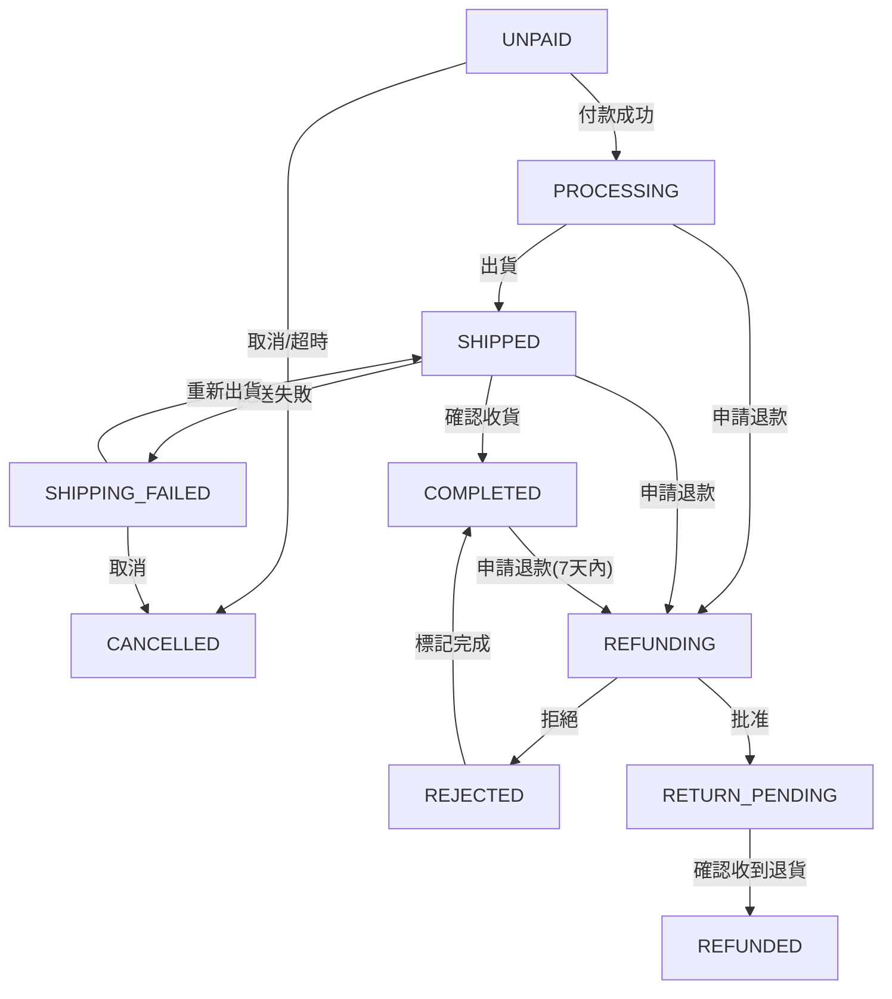

# 📜 專案開發規格書：Project Marauder（劫盜者計畫）

| 欄位 | 內容 |
|------|------|
| **專案名稱** | 衛氏巫師法寶店（Weasleys' Wizard Wheezes）數位轉型平台 |
| **專案代號** | Project Marauder |
| **版本** | v2.5 |
| **文件狀態** | 草案（PM 審閱修正：結構補全 + 邏輯一致性修正版） |
| **作者** | 喬治・衛斯理 / 弗雷・衛斯理 / 李亦婷 |
| **建立日期** | 2026-04-10 |
| **最後更新** | 2026-04-15 |

---

## 目錄

1. [專案概述](#一專案概述)
2. [使用者角色與權限](#二使用者角色與權限)
3. [系統架構與技術選型](#三系統架構與技術選型)
4. [認證系統（Authentication）](#四認證系統authentication)
5. [資料庫設計（Database Schema）](#五資料庫設計database-schema)
6. [前台消費者功能](#六前台消費者功能)
7. [後台管理平台](#七後台管理平台)
8. [支付方式管理](#八支付方式管理)
9. [訂單生命週期](#九訂單生命週期)
10. [後台控制中心（Prank Console）](#十後台控制中心prank-console)
11. [緊急掩護模式（Mischief Managed）](#十一緊急掩護模式mischief-managed)
12. [介面規格](#十二介面規格)
13. [驗收標準](#十三驗收標準)
14. [開發里程碑](#十四開發里程碑)
15. [風險與注意事項](#十五風險與注意事項)
16. [備緩方案（Fallback Mechanisms）](#十六備緩方案fallback-mechanisms)

---

## 一、專案概述

### 1.1 專案目標

打造一個充滿驚喜與不確定性的電商平台，透過後台強大的「惡作劇控制系統（Prank Console）」，讓管理員（喬治與弗雷）能即時操控前台消費者的購物體驗，藉此對抗無聊的魔法部法規。

### 1.2 核心價值

| 面向 | 說明 |
|------|------|
| **前台** | 混亂、有趣、沉浸式的斜角巷購物感 |
| **後台** | 高度可控的商品管理、動態定價機制與突發事件觸發器 |
| **差異化** | 唯一一家會主動嚇跑顧客又能讓顧客上癮的魔法電商 |

### 1.3 專案範圍（Scope）

**納入（In-Scope）：**
- 會員註冊 / 登入（本地帳號 + Google / Facebook OAuth）
- 商品瀏覽（含 SKU 規格選擇）、搜尋、加入購物車、結帳
- 模擬支付（魔法卡 / 巫師金庫轉帳 / 貨到付款）
- 完整訂單生命週期（待付款 → 待出貨 → 運送中 → 已完成）
- 後台商品 CRUD（含 SKU 維護）、訂單管理、促銷管理、數據報表
- 惡搞模式（純視覺動態定價、音效、飛七圖層；結帳金額以「加入購物車當下」的資料庫定價為準）
- 榮恩識別系統（家屬服務費）
- 緊急切換「文具店模式」（Mischief Managed）

**排除（Out-Scope）：**
- 真實金流串接（Galleon 不可兌換現金）
- 行動 App（iOS / Android）
- 多語言支援（僅繁體中文）
- 真實的石內卜教授

### 1.4 術語說明

| 術語 | 說明 |
|------|------|
| Galleon（金加隆） | 主要貨幣單位，1 Galleon = 17 Sickle |
| Sickle（銀閃） | 次要貨幣單位，1 Sickle = 29 Knut |
| Knut（納特） | 最小貨幣單位 |
| SKU | 最小庫存單位，對應商品特定規格（如：迷情劑 10ml / 50ml） |
| SPU | 標準商品單元，對應商品主表（如：迷情劑） |
| 榮恩稅 | 結帳總額 × 2 的家屬服務費彩蛋邏輯；由後端以 Email 關鍵字自動識別，**不在前端彈窗詢問**，避免打斷結帳流程 |
| 石內卜來訪 | 庫存歸零時觸發的缺貨警告狀態 |
| Prank Console | 後台惡作劇控制中心 |
| Mischief Managed | 緊急切換「普通文具店」模式的掩護機制 |
| OMS | Order Management System，訂單管理系統 |
| CRM | Customer Relationship Management，會員資料管理 |

---

## 二、使用者角色與權限

### 2.1 角色定義

| 角色 | 識別方式 | 說明 |
|------|---------|------|
| **一般消費者** | Email / Google / Facebook 帳號 | 瀏覽商品、加入購物車、結帳，需承受隨機惡搞特效 |
| **家屬榮恩** | 結帳時前端彈窗詢問「你是否為榮恩・衛斯理？」，確認後觸發（MVP 階段；後端串接後改由 Email 含 `ron` 自動識別） | 系統於訂單明細自動加入「家屬服務費 100%」，結帳金額 × 2；收據顯示「衛斯理家族特供方案已啟用」 |
| **魔法部 VIP** | 結帳 Email 含 `magic_admin` 關鍵字時自動識別 | 自動享有商品小計 15% 折扣；另可使用 `MINISTRY24`（額外 20%）等魔法部專屬優惠券 |
| **管理員（喬治/弗雷/李亦婷）** | 後台帳號密碼 | 擁有完整後台控制權限，依職責分工負責營運、金流或物流領域 |

### 2.2 功能存取權限對照表

| 功能 | 一般消費者 | 榮恩 | 魔法部 VIP | 管理員 |
|------|:--------:|:----:|:---------:|:------:|
| 瀏覽商品 | ✅ | ✅ | ✅ | ✅ |
| 加入購物車 | ✅ | ✅ | ✅ | ✅ |
| 結帳（正常價格） | ✅ | ❌ | ✅ | ✅ |
| 結帳（Email 含 Ron 自動加倍） | ❌ | ✅（自動觸發） | ❌ | ❌ |
| 查看訂單紀錄 | ✅ | ✅ | ✅ | ✅ |
| 商品 CRUD | ❌ | ❌ | ❌ | ✅ |
| 觸發惡搞模式 | ❌ | ❌ | ❌ | ✅ |
| 觸發吼叫信模式 | ❌ | ❌ | ❌ | ✅ |
| 觸發飛七巡邏 | ❌ | ❌ | ❌ | ✅ |
| 啟用 Mischief Managed | ❌ | ❌ | ❌ | ✅ |
| 管理訂單（出貨/取消） | ❌ | ❌ | ❌ | ✅ |
| 管理優惠券 | ❌ | ❌ | ❌ | ✅ |
| 查看報表 | ❌ | ❌ | ❌ | ✅ |

### 2.3 管理員職責分工

衛氏巫師法寶店後台共三位管理員，各自負責不同業務領域，權限層級相同，但日常操作重心不同。

| 管理員 | 職稱 | 負責領域 | 主要操作範疇 |
|--------|------|---------|------------|
| **喬治・衛斯理** | 營運總監 | 📊 營運 | 商品上下架、SKU 庫存管理、惡搞控制台（Prank Console）、Mischief Managed 掩護模式、訂單出貨標記 |
| **弗雷・衛斯理** | 財務長 | 💰 金流 | 退款審核與批准、榮恩稅追蹤、優惠券新增/停用、全站折扣設定、營收報表查閱 |
| **李亦婷** | 物流協調員 | 🚚 物流 | 配送異常處理、收件地址修改、退貨入庫確認、批量庫存釋放、物流報表查閱 |

#### 各領域報表存取對應

| 報表分頁 | 主責管理員 | 說明 |
|---------|----------|------|
| 📊 營運人員（營收統計、訂單分佈、熱門商品、轉化漏斗、庫存預警） | 喬治 | 整體經營健康度追蹤 |
| 💰 金流（退款明細、榮恩稅統計、優惠券折抵） | 弗雷 | 金加隆流向管控 |
| 🚚 物流（配送異常追蹤、庫存周轉、物流方式佔比、退貨入庫） | 李亦婷 | 貓頭鷹物流效率監控 |

> **注意**：所有管理員皆可查看完整後台，上表為日常職責分工，並非系統權限限制。緊急狀況下任何管理員均可代為處理其他領域的操作。

---

## 三、系統架構與技術選型

### 3.1 技術選型

#### 前端

| 項目 | 選擇 | 理由 |
|------|------|------|
| 框架 | React 19 + TypeScript | 類型安全，元件化開發 |
| 建構工具 | Vite | 快速 HMR |
| 樣式 | CSS Modules + CSS 變數 | 元件隔離，支援主題切換（惡搞 / 文具店模式） |
| 狀態管理 | Zustand | 輕量、適合商品 / 購物車 / 惡搞開關狀態 |
| 路由 | React Router v7 | 前後台路由分離 |
| 動畫 | Framer Motion | 飛七浮動圖層、頁面震動效果 |

#### 後端

| 項目 | 選擇 | 理由 |
|------|------|------|
| 執行環境 | Node.js + Express | 輕量，與前端同語言（TypeScript） |
| 資料庫 | SQLite（本機開發）/ MySQL（正式環境） | 關聯式結構適合訂單、SKU、優惠券等多表關聯；Prisma schema 僅需將 `provider` 改為 `"mysql"` 即可切換 |
| ORM | Prisma | Type-safe DB 操作，自動產生型別 |
| 認證 | JWT + bcrypt | 本地登入；OAuth token 由 Google / Facebook 發行 |
| 第三方 OAuth | Passport.js（Google / Facebook Strategy） | 標準 OAuth 2.0 流程 |
| 郵件通知 | Nodemailer + Gmail SMTP | 發送貓頭鷹確認信 |

> **MVP 建議**：Phase 1-2 使用 `localStorage` 模擬後端，Phase 3 再接入 Node.js + SQLite（本機）或 MySQL（正式）。

### 3.2 專案目錄結構

```
www-platform/
├── public/
│   ├── sounds/
│   │   └── howler.mp3          # 吼叫信音效
│   └── images/
│       ├── dark-mark.svg       # 黑魔標記
│       └── peeves.gif          # 飛七動圖
├── src/
│   ├── components/
│   │   ├── ProductCard/        # 商品卡片元件（含 SKU 選擇）
│   │   ├── Cart/               # 購物車
│   │   ├── CheckoutModal/      # 結帳彈窗（含榮恩識別 + 支付選擇）
│   │   ├── PeevesLayer/        # 飛七浮動圖層
│   │   ├── HowlerAlert/        # 吼叫信音效元件
│   │   └── MisManagedOverlay/  # Mischief Managed 掩護介面
│   ├── pages/
│   │   ├── Storefront/         # 前台商店
│   │   ├── OrderTracking/      # 訂單追蹤頁面
│   │   ├── Auth/               # 登入 / 註冊頁面
│   │   ├── Admin/
│   │   │   ├── Dashboard/      # 後台總覽（數據報表）
│   │   │   ├── Products/       # 商品管理（含 SKU）
│   │   │   ├── Orders/         # 訂單管理（OMS）
│   │   │   ├── Promotions/     # 促銷 / 優惠券管理
│   │   │   └── PrankConsole/   # 惡作劇控制中心
│   │   └── StationeryShop/     # Mischief Managed 文具店頁面
│   ├── store/
│   │   ├── productStore.ts     # 商品狀態
│   │   ├── cartStore.ts        # 購物車狀態
│   │   ├── prankStore.ts       # 惡搞模式開關狀態
│   │   ├── authStore.ts        # 用戶認證狀態
│   │   └── orderStore.ts       # 訂單狀態
│   ├── types/
│   │   └── index.ts            # 共用型別定義
│   ├── hooks/
│   │   ├── usePrankMode.ts     # 惡搞模式邏輯
│   │   └── usePageShake.ts     # 頁面震動計時器
│   └── App.tsx
├── server/                     # Node.js + Express 後端
│   ├── routes/
│   │   ├── auth.ts             # 認證路由
│   │   ├── products.ts         # 商品 API
│   │   ├── orders.ts           # 訂單 API
│   │   └── admin.ts            # 後台 API
│   ├── middleware/
│   │   └── authMiddleware.ts   # JWT 驗證中間件
│   ├── prisma/
│   │   └── schema.prisma       # 資料庫 Schema
│   └── index.ts
├── package.json
└── vite.config.ts
```

### 3.3 Mischief Managed 雙模式切換機制

```
[管理員按下 "Mischief Managed"]
         │
         ▼
  prankStore.activateMischiefManaged()
         │
         ├─ 關閉所有惡搞開關（prankMode、howler、peeves）
         ├─ 前台路由重導至 /stationery（普通文具店頁面）
         ├─ 後台顯示「文具店模式進行中」提示
         └─ localStorage 記錄原始商品資料（不清除）

[管理員按下 "Mischief Managed" 解除]
         │
         ▼
  prankStore.deactivateMischiefManaged()
         │
         └─ 前台路由恢復 /，惡搞設定恢復上次狀態
```

---

## 四、認證系統（Authentication）

### 4.1 登入 / 註冊（前台）

| 方式 | 流程說明 |
|------|---------|
| **本地登入** | 巫師信箱（Email）+ 密碼；後端以 bcrypt 雜湊儲存密碼 |
| **Google 登入** | OAuth 2.0，點擊後跳轉 Google 授權頁；成功後回傳 access_token，後端驗證並發行 JWT |
| **Facebook 登入** | OAuth 2.0，流程同 Google；取得用戶公開大頭貼與姓名 |

**登入後行為：**
- 自動抓取第三方頭像（avatar_url）與顯示名稱（display_name）存入資料庫
- 系統記錄 `auth_provider`（`local` / `google` / `facebook`）
- 發行雙 Token：
  - **Access Token**（有效期 15 分鐘）：存入 `httpOnly Cookie`（`access_token`），用於 API 請求驗證
  - **Refresh Token**（有效期 7 天）：存入 `httpOnly Cookie`（`refresh_token`），用於無感刷新 Access Token
- 前端 API 攔截器：Access Token 過期收到 `401 TOKEN_EXPIRED` 時，自動以 Refresh Token 呼叫 `POST /api/auth/refresh` 取得新 Access Token，再重試原請求（用戶無感）
- 管理員強制登出功能：後台可寫入 `TokenBlacklist`（Redis Set，TTL = Refresh Token 剩餘時間），使所有 Token 立即失效

### 4.2 會員資料管理（CRM）

| 欄位 | 說明 |
|------|------|
| `u_id` | UUID 主鍵 |
| `email` | 唯一，來自本地或 OAuth |
| `auth_provider` | `local` / `google` / `facebook` |
| `avatar_url` | 第三方頭像 URL |
| `display_name` | 顯示名稱 |
| `user_level` | `normal`（一般巫師）/ `ron`（家屬榮恩）/ `vip`（魔法部 VIP） |
| `created_at` | 帳號建立時間 |

---

## 五、資料庫設計（Database Schema）

### 5.1 核心資料表

#### Users（會員）

```sql
CREATE TABLE Users (
  u_id         CHAR(36)     PRIMARY KEY DEFAULT (UUID()),
  email        VARCHAR(255) UNIQUE NOT NULL,
  password_hash VARCHAR(255),                    -- 本地登入才有值
  auth_provider ENUM('local','google','facebook') NOT NULL DEFAULT 'local',
  avatar_url   TEXT,
  display_name VARCHAR(100),
  user_level   ENUM('normal','ron','vip')        NOT NULL DEFAULT 'normal',
  created_at   DATETIME     NOT NULL DEFAULT NOW(),
  updated_at   DATETIME     NOT NULL DEFAULT NOW() ON UPDATE NOW()
);
```

#### Products（商品 SPU 主表）

```sql
CREATE TABLE Products (
  p_id        CHAR(36)     PRIMARY KEY DEFAULT (UUID()),
  name        VARCHAR(100) NOT NULL,
  category    ENUM('prank','defense','love_potion','fireworks','magical_beast') NOT NULL,
  description TEXT,
  danger_level TINYINT     NOT NULL CHECK (danger_level BETWEEN 1 AND 5),
  media_url   TEXT,
  is_hidden   BOOLEAN      NOT NULL DEFAULT FALSE,
  created_at  DATETIME     NOT NULL DEFAULT NOW()
);
```

#### SKU_Items（商品規格與庫存）

```sql
CREATE TABLE SKU_Items (
  s_id        CHAR(36)     PRIMARY KEY DEFAULT (UUID()),
  p_id        CHAR(36)     NOT NULL REFERENCES Products(p_id),
  spec        VARCHAR(100) NOT NULL,   -- 規格說明，如「10ml」「50ml」「標準版」
  price_knut  DECIMAL(15,4) NOT NULL, -- 以 Knut 為最小單位；DECIMAL 避免折扣連算產生浮點誤差
  stock       INT UNSIGNED NOT NULL DEFAULT 0,
  weight_g    INT UNSIGNED,           -- 重量（公克，供運費計算）
  image_url   TEXT,                   -- 規格專屬圖片（選填）
  UNIQUE KEY (p_id, spec)
);
```

#### Orders（訂單）

```sql
CREATE TABLE Orders (
  o_id          CHAR(36)  PRIMARY KEY DEFAULT (UUID()),
  u_id          CHAR(36)  NOT NULL REFERENCES Users(u_id),
  status        ENUM('unpaid','processing','shipped','completed','cancelled','refunding','refunded') NOT NULL DEFAULT 'unpaid',
  total_knut    DECIMAL(15,4) NOT NULL, -- 下單時前端傳入的估算金額（含折扣、榮恩稅）；與 final_captured_amount 的差異：此欄為下單時計算值，後者為付款回調後後端確認的實際扣款金額
  shipping_method ENUM('instant','broom','thestral','knight_bus') NOT NULL,
  payment_method  ENUM('vault_transfer','cash_on_delivery','mock_card') NOT NULL,
  tracking_number VARCHAR(100),
  shipping_address TEXT NOT NULL,
  is_ron        BOOLEAN   NOT NULL DEFAULT FALSE,  -- 是否為榮恩（加倍收費）
  coupon_id     CHAR(36)  REFERENCES Coupons(c_id),
  discount_snapshot JSON,                          -- 建立訂單時快照折扣規則（優惠券代碼、折扣類型、折扣金額）；優惠券刪除後歷史訂單仍可重建折扣明細（AC-24）
  created_at    DATETIME  NOT NULL DEFAULT NOW(),
  updated_at    DATETIME  NOT NULL DEFAULT NOW() ON UPDATE NOW()
);
```

#### Order_Items（訂單明細）

```sql
CREATE TABLE Order_Items (
  oi_id       CHAR(36)  PRIMARY KEY DEFAULT (UUID()),
  o_id        CHAR(36)  NOT NULL REFERENCES Orders(o_id),
  s_id        CHAR(36)  NOT NULL REFERENCES SKU_Items(s_id),
  quantity    INT UNSIGNED NOT NULL,
  unit_price_knut DECIMAL(15,4) NOT NULL -- 加入購物車當下的快照定價（與惡搞顯示價格無關）
);
```

#### Coupons（優惠券）

```sql
CREATE TABLE Coupons (
  c_id          CHAR(36)     PRIMARY KEY DEFAULT (UUID()),
  code          VARCHAR(50)  UNIQUE NOT NULL,      -- 折扣代碼，如「MischiefManaged」
  discount_type ENUM('percentage','fixed')  NOT NULL,
  discount_value DECIMAL(15,4) NOT NULL,          -- 百分比折扣或固定折扣金額（Knut），DECIMAL 確保多次折扣精度
  min_spend_knut DECIMAL(15,4) DEFAULT 0,         -- 最低消費門檻
  max_uses      INT UNSIGNED,                     -- 最大使用次數（NULL = 無限制）
  used_count    INT UNSIGNED NOT NULL DEFAULT 0,
  expires_at    DATETIME,
  is_active     BOOLEAN NOT NULL DEFAULT TRUE,
  created_at    DATETIME NOT NULL DEFAULT NOW()
);
```

#### Admin_Audit_Logs（管理員操作日誌）

```sql
CREATE TABLE Admin_Audit_Logs (
  log_id      CHAR(36)     PRIMARY KEY DEFAULT (UUID()),
  admin_id    CHAR(36)     NOT NULL REFERENCES Users(u_id),
  action      VARCHAR(100) NOT NULL,              -- 操作類型，如 'BULK_CANCEL', 'REFUND_APPROVE', 'PRODUCT_DELETE'
  target_type VARCHAR(50),                        -- 操作對象類型，如 'Order', 'Product', 'SKU'
  target_id   CHAR(36),                           -- 操作對象的主鍵 ID
  payload     JSON,                               -- 操作的詳細參數快照（如批量取消的 orderIds 陣列）
  ip_address  VARCHAR(45),                        -- 操作者 IP（IPv4 / IPv6）
  created_at  DATETIME     NOT NULL DEFAULT NOW()
);
```

### 5.2 TypeScript 型別定義（前端對應）

```typescript
// 商品 SPU
interface Product {
  id: string;
  name: string;
  category: ProductCategory;
  description: string;
  dangerLevel: 1 | 2 | 3 | 4 | 5;
  mediaUrl: string;
  isHidden: boolean;
  skuItems: SKUItem[];
  createdAt: string;
}

// SKU 規格
interface SKUItem {
  id: string;
  productId: string;
  spec: string;          // 如「10ml」「50ml」
  price: {
    galleon: number;
    sickle: number;
    knut: number;
  };
  stock: number;
  weightG?: number;
  imageUrl?: string;
}

// 訂單
interface Order {
  id: string;
  userId: string;
  status: 'unpaid' | 'processing' | 'shipped' | 'completed' | 'cancelled';
  totalKnut: number;
  shippingMethod: ShippingMethod;
  paymentMethod: PaymentMethod;
  trackingNumber?: string;
  shippingAddress: string;
  isRon: boolean;
  couponId?: string;
  items: OrderItem[];
  createdAt: string;
}

// 系統設定
interface SystemConfig {
  prankModeEnabled: boolean;
  howlerModeEnabled: boolean;
  peevesPatrolActive: boolean;
  misManagedActive: boolean;
  priceRandomMin: number;   // 預設 0.5
  priceRandomMax: number;   // 預設 5.0
}
```

### 5.3 API 端點設計

| 方法 | 路徑 | 說明 | 權限 |
|------|------|------|------|
| POST | `/api/auth/register` | 本地帳號註冊 | 公開 |
| POST | `/api/auth/login` | 本地帳號登入 | 公開 |
| POST | `/api/auth/refresh` | 以 Refresh Token 取得新 Access Token | 公開（需有效 refresh_token Cookie） |
| POST | `/api/auth/logout` | 登出，清除 Cookie 並將 Refresh Token 加入 Redis 黑名單 | 登入用戶 |
| GET | `/api/auth/google` | Google OAuth 跳轉 | 公開 |
| GET | `/api/auth/facebook` | Facebook OAuth 跳轉 | 公開 |
| GET | `/api/admin/audit-logs` | 取得管理員操作日誌（支援 `?action=&page=`） | 管理員 |
| GET | `/api/products` | 取得所有商品（排除隱藏）；支援查詢參數：`?q=關鍵字&category=prank&danger=3&page=1&limit=20` | 公開 |
| GET | `/api/products/all` | 取得所有商品（含隱藏）；查詢參數同上 | 管理員 |
| POST | `/api/products` | 新增商品 SPU（不含 SKU，SKU 由獨立端點管理） | 管理員 |
| PUT | `/api/products/:id` | 更新商品 SPU 資訊 | 管理員 |
| DELETE | `/api/products/:id` | 刪除商品（同時刪除所有 SKU） | 管理員 |
| GET | `/api/products/:id/skus` | 取得商品所有 SKU | 公開 |
| POST | `/api/products/:id/skus` | 新增 SKU 規格 | 管理員 |
| PUT | `/api/products/:id/skus/:skuId` | 更新 SKU 規格（價格、庫存、重量、圖片） | 管理員 |
| PATCH | `/api/products/:id/skus/:skuId/stock` | 更新單一 SKU 庫存（含「從辦公室偷回」恢復為 5） | 管理員 |
| DELETE | `/api/products/:id/skus/:skuId` | 刪除 SKU（需確認無未完成訂單） | 管理員 |
| GET | `/api/orders` | 取得我的訂單 | 登入用戶 |
| GET | `/api/orders/all` | 取得所有訂單 | 管理員 |
| POST | `/api/orders` | 建立訂單（所有付款方式皆立即扣除 `stock`） | 登入用戶 |
| PATCH | `/api/orders/:id/status` | 更新訂單狀態（通用） | 管理員 |
| POST | `/api/orders/:id/payment` | 模擬付款（釋放 `stock_reserved`） | 登入用戶 |
| POST | `/api/orders/:id/cancel` | 取消訂單（`stock` 回補 + `stock_reserved` 歸零） | 登入用戶 / 管理員 |
| POST | `/api/orders/:id/refund-request` | 申請退款（`processing`/`shipped`/`completed` → `refunding`） | 登入用戶 |
| POST | `/api/orders/:id/refund-approve` | 批准退款（`refunding` → `return_pending`，等待退貨） | 管理員 |
| POST | `/api/orders/:id/return-received` | 確認收到退貨（`return_pending` → `refunded`，`stock += qty`） | 管理員 |
| POST | `/api/orders/:id/refund-reject` | 拒絕退款（`refunding` → `rejected`，含原因） | 管理員 |
| POST | `/api/orders/:id/shipping-failed` | 標記配送異常（`shipped` → `shipping_failed`） | 管理員 |
| POST | `/api/orders/:id/confirm-receipt` | 確認收到商品（`shipped` → `completed`） | 登入用戶 |
| POST | `/api/orders/bulk-release` | 批量強制釋放凍結庫存（`unpaid` → `cancelled`） | 管理員 |
| PATCH | `/api/orders/:id/address` | 修改收件地址（限 `processing` 狀態） | 管理員 |
| GET | `/api/coupons` | 取得優惠券列表 | 管理員 |
| POST | `/api/coupons` | 新增優惠券 | 管理員 |
| POST | `/api/coupons/validate` | 驗證優惠券代碼 | 登入用戶 |
| GET | `/api/config` | 取得系統設定 | 管理員 |
| PUT | `/api/config` | 更新系統設定（惡搞開關） | 管理員 |
| GET | `/api/reports/revenue` | 營收報表 | 管理員 |
| GET | `/api/reports/top-products` | 商品銷量排行 | 管理員 |

### 5.4 API 異常清單

所有 API 端點共用的標準化錯誤回應格式與錯誤碼定義。

**錯誤回應格式（統一）：**
```json
{
  "success": false,
  "code": "OUT_OF_STOCK",
  "message": "石內卜已沒收最後一件，庫存不足",
  "detail": { "skuId": "xxx", "requested": 2, "available": 0 }
}
```

| HTTP 狀態 | 錯誤碼 | 前台顯示訊息（中文） | 觸發情境 |
|-----------|--------|-------------------|---------|
| 400 | `INVALID_EMAIL` | 「貓頭鷹找不到這個魔法信箱格式」 | Email 格式錯誤 |
| 400 | `INVALID_QUANTITY` | 「訂購數量不可超過庫存上限」 | 加入購物車數量 > 庫存 |
| 400 | `COUPON_EXPIRED` | 「此優惠券已過期或不存在」 | 優惠券驗證失敗 |
| 400 | `COUPON_MIN_SPEND` | 「消費未達最低門檻，無法使用此優惠券」 | 未達 `min_spend_knut` |
| 400 | `COUPON_MAX_USES` | 「此優惠券已超過使用次數上限」 | `used_count >= max_uses` |
| 401 | `UNAUTHORIZED` | 「請先登入您的魔法帳號」 | JWT 缺失或無效 |
| 401 | `TOKEN_EXPIRED` | 「登入憑證已過期，請重新登入」 | JWT 過期 |
| 403 | `FORBIDDEN` | 「您沒有施展此魔法的權限」 | 非管理員存取後台 API |
| 404 | `PRODUCT_NOT_FOUND` | 「此法寶已消失在斜角巷某處」 | 商品 ID 不存在 |
| 404 | `ORDER_NOT_FOUND` | 「找不到此訂單記錄」 | 訂單 ID 不存在 |
| 409 | `OUT_OF_STOCK` | 「石內卜已沒收最後一件，庫存不足」 | 下單時庫存為 0 |
| 409 | `DUPLICATE_EMAIL` | 「此魔法信箱已被其他巫師註冊」 | 重複 Email 註冊 |
| 409 | `ORDER_STATUS_CONFLICT` | 「此訂單當前狀態不允許執行此操作」 | 狀態機衝突（如取消已完成訂單） |
| 422 | `PAYMENT_FAILED` | 「魔法傳輸失敗，請稍後重試」 | 模擬支付超時 |
| 429 | `RATE_LIMIT` | 「請求過於頻繁，石內卜警告您放慢腳步」 | 單 IP 超過 30 次/分鐘 |
| 500 | `INTERNAL_ERROR` | 「魔法部干擾導致伺服器異常，請稍後再試」 | 未預期後端錯誤 |

### 5.5 下單等冪性機制（Idempotency Key）

> **設計原則（PM 修正 v2.3）**：結帳按鈕因網路延遲或用戶手滑可能被連續點擊，導致後端收到多個重複下單請求。Idempotency Key 確保同一筆結帳動作無論重送幾次，資料庫只建立一筆訂單。

**前端實作：**

```typescript
// 結帳前在 Client 端產生唯一 Key，存入 sessionStorage
// Key 生命週期：成功後清除；業務/伺服器錯誤清除（下次用新 Key）；網路中斷保留（重試同一筆）
const handleCheckout = async () => {
  let idemKey = sessionStorage.getItem('checkout_idem_key')
  if (!idemKey) {
    idemKey = crypto.randomUUID()                         // 瀏覽器原生 UUID
    sessionStorage.setItem('checkout_idem_key', idemKey)
  }

  setSubmitting(true)                                     // 按鈕進入 disabled 狀態
  try {
    await api.post('/api/orders', payload, {
      headers: { 'X-Idempotency-Key': idemKey }
    })
    sessionStorage.removeItem('checkout_idem_key')        // 成功後清除
    navigate('/orders/success')
  } catch (err) {
    if (err.code === 'NETWORK_ERROR') {
      // 網路中斷：請求可能已抵達後端，保留 Key 讓下次重試帶入同一筆
      // 若後端已建單並快取成功結果，重試會返回快取而不重複建立訂單
    } else {
      // 業務錯誤（含 422 PAYMENT_FAILED、409 OUT_OF_STOCK）或伺服器錯誤：清除 Key
      // 注意：後端僅快取 200/201，不快取任何 4xx/5xx（詳見下方 Key 生命週期分類表）
      // 因此 422 不會留下舊的「失敗快取」，清除 Key 讓用戶以新資料（換卡/修正地址）重新發起請求
      sessionStorage.removeItem('checkout_idem_key')
    }
  } finally {
    setSubmitting(false)
  }
}
```

**按鈕狀態規則：**

| 狀態 | 按鈕文字 | `disabled` |
|------|---------|-----------|
| 可送出 | 「確定交出金加隆」 | `false` |
| 傳輸中 | 「魔法傳輸中...」 | `true` |
| 已完成 | 「訂單已建立！」 | `true` |
| 業務錯誤 | 「確定交出金加隆」（重置） | `false` |

**Key 生命週期分類（PM 修正 v2.4）：**

| 錯誤類型 | HTTP 狀態碼 | 前端 Key 處置 | 說明 |
|---------|-----------|------------|------|
| 成功 | 200 / 201 | **清除** | 訂單已建立，此 Key 完成任務 |
| 網路中斷 | 無回應 | **保留** | 請求可能已達後端；重試帶同 Key，後端若已建單回傳快取，不重複建單 |
| 支付失敗（可重試） | 422 `PAYMENT_FAILED` | **清除** | 後端不快取 4xx；清除 Key 讓用戶換卡後以全新請求重試，不會誤返舊失敗結果 |
| 業務衝突 | 409 `OUT_OF_STOCK` 等 | **清除** | 狀態已改變（庫存不足），不可重送同一筆，需修正後以新 Key 重試 |
| 伺服器錯誤 | 5xx | **清除** | 後端異常，不確定訂單是否建立；清除 Key，讓用戶確認後以新 Key 重試 |

**後端 Idempotency Guard（Express middleware）：**

> **Redis 快取規則（關鍵）**：Idempotency Guard **僅快取 HTTP 200 / 201 的成功回應**，任何 4xx / 5xx 絕不寫入 Redis。此規則確保可重試的失敗（如 422 PAYMENT_FAILED）不會被永久快取，用戶清除 Key 後以新 Key 重試，後端不會誤判為「已處理」而回傳舊失敗結果。

```typescript
// server/middleware/idempotency.ts
// 以 Redis 快取 Key，10 分鐘內重複請求直接回傳快取結果
// ⚠️  僅快取成功回應（200/201）；4xx/5xx 一律不存入快取，確保可重試失敗不被鎖定
export const idempotencyGuard = async (req: Request, res: Response, next: NextFunction) => {
  const key = req.headers['x-idempotency-key'] as string
  if (!key) return next()                               // 非必填，向下相容

  const cached = await redis.get(`idem:${key}`)
  if (cached) {
    return res.status(200).json(JSON.parse(cached))     // 回傳快取訂單結果
  }

  res.on('finish', async () => {
    // 只有成功回應才存入 Redis；失敗回應不快取，讓前端可以用新 Key 重試
    if (res.statusCode === 200 || res.statusCode === 201) {
      await redis.setex(`idem:${key}`, 600, JSON.stringify(res.locals.responseBody))
    }
    // 4xx / 5xx：不寫入 Redis，Key 在前端被清除後即失效
  })
  next()
}
```

---

## 六、前台消費者功能

### 6.1 商品瀏覽

- **SKU 選擇**：商品卡片展開規格選單（如：迷情劑 10ml / 50ml），選擇後即時更新顯示價格與庫存
- **篩選功能**：可依「魔法類別」與「危險等級」過濾商品
- **庫存顯示**：即時顯示各 SKU 庫存量
  - 庫存 > 0：「立即交出金加隆」按鈕可用
  - 庫存 = 0：圖片灰階，按鈕禁用，顯示「石內卜來訪：已被沒收」

### 6.2 結帳流程

> **設計原則（PM 修正 v2.1）**：榮恩識別改為「彩蛋式自動偵測」，由後端在建立訂單前靜默判斷，不以彈窗中斷結帳流程，避免轉化率受損。

```
用戶點擊「結帳」
     │
     ▼
填寫收件資訊（地址）
     │
     ▼
選擇配送方式（見下表）
     │
     ▼
選擇支付方式（見第八節）
     │
     ▼
輸入優惠券代碼（選填）
     │
     ▼
確認訂單
     │
     ▼
後端靜默判斷：用戶 Email 是否含 "ron"（不分大小寫）
├─ 是 ──→ is_ron = TRUE，訂單明細自動加入「衛斯理家族特供方案 +100%」
└─ 否 ──→ is_ron = FALSE，維持正常定價
     │
     ▼
⚠️  魔法波動免責聲明（結帳頁顯示）：
   「本店商品定價受斜角巷魔法擾動影響，最終成交金額以訂單確認頁為準」
     │
     ▼
系統建立訂單（status: unpaid）→ 跳轉訂單追蹤頁面
```

**榮恩識別邏輯（後端）：**
```typescript
// 後端 POST /api/orders — 建立訂單時實時偵測（每次下單重新判斷，以當下 Email 為準）
// 注意：user_level 欄位在此同步更新，但 is_ron 以 Email 實時判斷為唯一依據
// 若用戶更換 Email（本地帳號）後再下單，新訂單依新 Email 重新判斷；舊訂單 is_ron 不回溯修改
const isRon = user.email.toLowerCase().includes('ron')
if (isRon && user.user_level !== 'ron') {
  await db.user.update({ where: { u_id: user.u_id }, data: { user_level: 'ron' } })
}
const finalTotal = isRon ? subtotal * 2 : subtotal
// 在訂單明細插入彩蛋說明（不事先告知用戶）
if (isRon) {
  orderItems.push({ label: '衛斯理家族特供方案', amount: subtotal })
}
```

#### 配送方式

| 選項 | 代碼 | 說明 | 預估時間 |
|------|------|------|---------|
| 消影術 | `instant` | 瞬間送達，不保證完整性 | 即時 |
| 飛天掃帚 | `broom` | 快速空運 | 1-2 小時 |
| 騎士墜鬼馬 | `thestral` | 標準陸運（僅目睹死亡者可見配送員） | 1-3 天 |
| 騎士公車 | `knight_bus` | 社交體驗方案，途中可能繞路數次 | 不定 |

### 6.3 訂單追蹤

用戶可在「我的訂單」頁面查看訂單狀態進度條：

```
待付款（Unpaid）→ 待出貨（Processing）→ 運送中（Shipped）→ 已完成（Completed）
```

- **待出貨 → 運送中**：管理員填入「貓頭鷹物流單號」後自動更新
- **運送中 → 已完成**：用戶點擊「確認收到商品」
- **付款後任意狀態（processing / shipped / completed）**：用戶可申請退款，進入退款流程

### 6.4 訂單狀態全集（Master Status List v3.0）

#### 進行中

| 狀態代碼 | 顯示名稱 | 庫存動作 | 說明 |
|---------|---------|---------|------|
| `unpaid` | ⏳ 待付款 | 實際扣除（`stock -= qty`）| 訂單已建立，商品庫存立即扣除（非 COD 額外凍結 `stock_reserved`） |
| `processing` | 📦 待出貨 | 釋放凍結（`stock_reserved -= qty`）| 付款成功，通知備貨打包 |
| `shipped` | 🚀 運送中 | 無變動 | 管理員已填貓頭鷹物流單號，包裹在空中 |

#### 逆向流程

| 狀態代碼 | 顯示名稱 | 庫存動作 | 說明 |
|---------|---------|---------|------|
| `refunding` | 🔄 退款審核中 | 鎖定中 | 用戶付款後申請退款，等待管理員審核 |
| `return_pending` | 📮 退貨中 | 鎖定中 | 管理員批准退款，等待用戶寄回商品 |

#### 異常處理

| 狀態代碼 | 顯示名稱 | 庫存動作 | 說明 |
|---------|---------|---------|------|
| `shipping_failed` | ⚠️ 配送異常 | 維持扣除 | 貓頭鷹找不到地址，管理員介入修正後可重新出貨 |
| `rejected` | 🚫 退款被拒絕 | 維持扣除 | 管理員拒絕退款（如：商品已被石內卜破壞），可再轉為 `completed` |

#### 終點站

| 狀態代碼 | 顯示名稱 | 庫存動作 | 說明 |
|---------|---------|---------|------|
| `completed` | ✅ 已完成 | 結束生命週期 | 用戶確認收貨，交易圓滿結案，自動發放驚喜券 |
| `cancelled` | ❌ 已取消 | 還原庫存（`stock += qty`）+ 釋放凍結 | 付款前終止，庫存完整回補 |
| `refunded` | 💸 已退款 | 回補（`stock += qty`）| 確認收到退貨後完成退款，庫存回補 |

#### 核心流程路徑

```
── 付款前取消 ──
UNPAID → CANCELLED（stock 回補 + stock_reserved 歸零）

── 付款後退款（含退貨）──
PROCESSING / SHIPPED / COMPLETED
  → REFUNDING（用戶申請）
  → RETURN_PENDING（管理員批准，等待收貨）
  → REFUNDED（確認收貨，stock += qty）

── 退款被拒絕 ──
REFUNDING → REJECTED（管理員拒絕，附理由）→ COMPLETED

── 配送異常 ──
SHIPPED → SHIPPING_FAILED（管理員標記）→ SHIPPED（重新出貨）/ CANCELLED
```

#### 狀態流程圖（Mermaid）



---

## 七、後台管理平台

### 7.1 商品與庫存管理

| 功能 | 說明 |
|------|------|
| **上下架** | 一鍵切換 Hidden / Visible（隱身咒） |
| **SKU 維護** | 可設定不同規格的價格、庫存、重量、圖片 |
| **庫存預警** | 當任何 SKU 庫存低於 5 件時，後台導覽列顯示紅光閃爍提醒補貨（石內卜警告色）|
| **從辦公室偷回** | 庫存 = 0 時顯示，按下後該 SKU 庫存恢復為 5 |

#### 庫存狀態機

```
庫存 > 0  ──→  [正常]   按鈕顯示：「立即交出金加隆」（可購買）
庫存 = 0  ──→  [缺貨]   圖片轉灰階，按鈕禁用，顯示：「石內卜來訪：已被沒收」
管理員按「從辦公室偷回」──→ 庫存恢復為 5，狀態回到 [正常]
```

### 7.2 訂單管理（OMS）

| 功能 | 說明 |
|------|------|
| **訂單列表** | 顯示訂單號、下單時間、付款方式、訂單總額、訂單狀態 |
| **狀態篩選** | 可依全部 11 種訂單狀態篩選；`refunding`、`return_pending`、`shipping_failed` 顯示數量徽章提醒 |
| **一鍵出貨** | 點擊「標記為已出貨」，填入貓頭鷹物流單號，前台用戶狀態即時更新 |
| **標記配送異常** | `shipped` 狀態下管理員可標記為 `shipping_failed`；修正地址後可重新出貨 |
| **取消訂單** | 管理員可手動取消訂單；`unpaid` 狀態下庫存全數回補並釋放凍結 |
| **修改地址** | 管理員可修改收件地址（僅限 `processing` 狀態） |
| **退款批准** | `refunding` → `return_pending`，通知用戶寄回商品 |
| **確認收到退貨** | `return_pending` → `refunded`，庫存自動回補（`stock += qty`） |
| **退款拒絕** | 填寫拒絕原因（如：「法寶已被石內卜沒收，無法退還」），`refunding` → `rejected`；後續可再轉 `completed` |

### 7.3 促銷管理

#### 全站折扣

- 設定「開學季全館 8 折」（`percentage` 類型，`discount_value: 80`）
- 套用於結帳時所有商品小計

#### 優惠券（Coupon）

| 欄位 | 範例 |
|------|------|
| 代碼 | `MischiefManaged` |
| 折扣類型 | 固定金額折扣（`fixed`） |
| 折扣金額 | 5 金加隆（= 5 × 17 × 29 Knut） |
| 最低消費 | 50 金加隆 |

- 結帳時用戶輸入代碼驗證，後端確認有效性後自動計算折扣
- 使用次數上限達到後自動停用

#### 黑魔標記模式

- 危險等級 = 5 的商品，前台自動加註黑魔標記 + 標題閃爍紅色

### 7.4 數據報表（Analytics Dashboard）

#### 7.4.1 營運人員報表

| 報表項目 | 說明 | 關鍵指標 |
|---------|------|---------|
| **營收統計** | 以折線圖顯示今日 / 本週 / 本月營業額 | 日 / 週 / 月營業額 |
| **今日訂單數** | 當日新增訂單總數 | 訂單數 |
| **累積營業額** | 所有 `completed` 訂單加總 | 累積金加隆數 |
| **商品銷量排行** | 「最常整到人的法寶」Top 5（依銷售量排行） | 銷售量 Top 5 |
| **轉化率** | 進站人數 vs. 完成下單人數百分比 | 轉化率 % |
| **庫存預警列表** | SKU 庫存 < 5 的品項一覽（石內卜警告色） | 低庫存 SKU 數 |

---

#### 7.4.2 金流報表

| 報表項目 | 說明 | 關鍵指標 | 資料來源 |
|---------|------|---------|---------|
| **退款明細報表** | 列出所有 `refunded` 狀態訂單，含退款原因（`refund_reject_reason`）、原始單號、退款耗時（`updated_at - created_at`） | 退款總額、平均退款耗時 | `Order` where `status = 'refunded'` |
| **榮恩稅專案收入** | 統計 `is_ron = true` 的訂單所產生的 100% 家屬服務費（`total_knut / 2` 為服務費金額，因結帳時已 ×2） | 家族貢獻度總額（金加隆）、榮恩訂單筆數 | `Order` where `is_ron = true` |
| **優惠券折抵統計** | 各優惠券代碼被使用次數（`Coupon.used_count`）與折抵總金額（由 `discount_snapshot` 加總） | 使用次數、折扣成本（金加隆） | `Coupon` JOIN `Order` |

> **注意**：「交易對帳總表」因模擬支付無獨立帳本，系統訂單額與金庫入帳額為同一數據來源，差異恆為零，不予實作。

---

#### 7.4.3 物流報表

| 報表項目 | 說明 | 關鍵指標 | 資料來源 |
|---------|------|---------|---------|
| **配送異常追蹤表** | 列出所有 `shipping_failed` 狀態訂單，含收件地址與配送方式，提供管理員優先處理依據 | 異常包裹數、各配送方式異常率 | `Order` where `status = 'shipping_failed'` |
| **庫存周轉分析** | 依各 SKU 的 `StockLog`（`reason = 'order_placed'`）統計銷售速度；高周轉（熱賣法寶）與低周轉（滯銷）分區顯示 | 庫存周轉天數（DIO）、熱賣 Top 5 / 滯銷 Bottom 5 | `StockLog` GROUP BY `s_id` JOIN `SKUItem` |
| **物流方式佔比** | 統計用戶選擇「消影術 / 飛天掃帚 / 賽斯托 / 騎士公車」的訂單比例與件數 | 各方式佔比（%）、件數 | `Order.shipping_method GROUP BY` |
| **退貨入庫統計** | 統計 `return_pending` 最終轉為 `refunded` 的件數；不含毀損率（schema 無對應欄位，需人工標記） | 退貨件數、退款完成件數、待確認件數 | `Order` where `status IN ('return_pending', 'refunded')` |

> **注意**：「物流時效監控表」因 `Order` 表僅有 `created_at` / `updated_at`，缺乏 per-status 時間戳，無法準確計算各階段耗時，待後續補充 status history 表後再行實作。

### 7.5 圖片／影片上傳規格

| 類型 | 欄位 | 允許格式 | 大小上限 | 建議尺寸 | 說明 |
|------|------|---------|---------|---------|------|
| 商品動圖 | `Products.media_url` | GIF、APNG、WebP（動態） | **3 MB** | 400×400px | 商品主展示動圖 |
| 商品靜態圖 | `Products.media_url` | JPEG、PNG、WebP | **1 MB** | 400×400px | 無動圖時的備用靜態圖 |
| SKU 規格圖 | `SKU_Items.image_url` | JPEG、PNG、WebP | **1 MB** | 200×200px | 各規格差異圖（如顏色、容量） |
| 飛七動圖 | `public/images/peeves.gif` | GIF | **500 KB** | 120×120px | 前台浮動圖層，尺寸固定 |

**前端效能規則：**
- GIF 超過 1 MB 時，商品卡片先顯示 loading skeleton，避免長時間空白閃爍
- `media_url` 為空時顯示預設黑魔法師帽 SVG 佔位圖（不破版）
- 後台上傳欄位：`<input accept="image/jpeg,image/png,image/webp,image/gif,image/apng">`

**後端驗證（Multer 設定）：**
```typescript
// server/middleware/uploadMiddleware.ts
// 限制上傳大小與格式，防止非圖片檔案入庫
const upload = multer({
  limits: { fileSize: 3 * 1024 * 1024 },        // 最大 3 MB
  fileFilter: (_req, file, cb) => {
    const allowed = ['image/jpeg', 'image/png', 'image/webp', 'image/gif', 'image/apng']
    cb(null, allowed.includes(file.mimetype))    // 非允許格式直接拒絕
  }
})
```

### 7.6 管理員操作日誌（Audit Log）

| 功能 | 說明 |
|------|------|
| **日誌列表** | 依時間倒序顯示所有管理員操作記錄（action、target、IP、時間） |
| **操作篩選** | 可依操作類型（`BULK_CANCEL` / `REFUND_APPROVE` / `PRODUCT_DELETE` 等）篩選 |
| **詳細展開** | 點擊任一記錄展開 `payload` JSON 詳情（如批量取消的訂單 ID 列表） |
| **不可刪除** | 日誌為不可刪除的唯讀記錄，確保操作可追溯性 |

> 所有「不可逆操作」（批量取消、退款批准/拒絕、商品刪除、強制庫存歸零）必須同步寫入 `Admin_Audit_Logs`，由後端 middleware 統一處理，不依賴各 API 個別實作。

### 7.7 批量操作工具與系統心跳（Batch Operations & Health Check）

#### 批量強制釋放庫存

> **情境**：`node-cron` 排程若發生異常停擺，未付款訂單的 `stock_reserved` 不會自動歸零，需提供管理員手動校正工具。

| 功能 | 說明 |
|------|------|
| **批量選取** | 後台訂單列表支援 checkbox 多選，狀態篩選為 `unpaid` |
| **強制釋放** | 管理員點擊「強制釋放庫存」→ 後端批次執行 `stock_reserved -= quantity`，訂單狀態→ `cancelled`，寫入 Audit Log |
| **確認彈窗** | 操作前顯示「即將取消 N 筆訂單，釋放共 M 件庫存，此操作不可逆」，需二次確認 |

```typescript
// PATCH /api/orders/bulk-cancel
// body: { orderIds: string[], reason: 'admin_force_release' }
// 後端以 Transaction 批次更新，確保原子性
```

#### 系統心跳 API（Health Check）

```
GET /api/health
Authorization: 管理員 JWT（防止外部偵探查探）

Response 200 OK:
{
  "status": "ok",
  "timestamp": "2026-04-14T12:00:00Z",
  "services": {
    "database":      { "status": "ok",      "latencyMs": 12 },
    "redis":         { "status": "ok",      "latencyMs": 3  },
    "jwtSecret":     { "status": "ok"                       },
    "nodeCron":      { "status": "ok",      "lastRun": "2026-04-14T11:45:00Z" },
    "mischiefGuard": { "status": "active",  "blacklistSize": 3 }
  }
}

Response 503 Service Unavailable:
{
  "status": "degraded",
  "services": {
    "database": { "status": "error", "error": "Connection timeout" }
  }
}
```

後台「系統狀態」頁面每 30 秒輪詢此端點，任一服務異常時顯示紅色警示橫幅。

---

## 八、支付方式管理

後台可設定開啟 / 關閉各支付選項，前台結帳時供用戶選擇。

### 8.1 巫師金庫轉帳（模擬銀行轉帳）

- 用戶輸入「古靈閣金庫帳號末五碼」
- 訂單狀態維持「待付款」，直到管理員於後台點擊「確認入帳」
- 管理員確認後，訂單自動轉為「待出貨」
- **超時規則**：金庫轉帳需人工操作，不適用 15 分鐘自動取消；改為 **72 小時**內若管理員未確認入帳，系統自動取消訂單並釋放凍結庫存，Email 通知「古靈閣轉帳逾期，訂單已自動取消」（`node-cron` 排程每小時掃描）

### 8.2 貨到交金加隆（模擬貨到付款）

- 用戶選擇此選項後直接成立訂單（status: `processing`，無需等待付款確認）
- 系統備註「貓頭鷹送達時收款」
- 管理員出貨時標記，訂單送達後自動轉為「已完成」
- **超時規則**：貨到付款無 15 分鐘限制（訂單直接進入 `processing`，庫存已正式扣除）

### 8.3 魔法卡（模擬信用卡）

- 用戶輸入任意 16 位數卡號（前端不驗證真實性）
- 點擊「送出魔法傳輸」後：
  1. 前端播放 3 秒「魔法傳輸中...」動畫
  2. 動畫結束後後端直接回傳「支付成功」
  3. 訂單狀態自動更新為「待出貨」

```typescript
// 模擬支付流程（前端）
const handleMockPayment = async () => {
  setPaymentStatus('processing')
  await new Promise(resolve => setTimeout(resolve, 3000))  // 3 秒動畫
  await api.post(`/orders/${orderId}/payment`)             // 通知後端
  setPaymentStatus('success')
  navigate(`/orders/${orderId}`)
}
```

### 8.4 支付安全與隱私規範

#### PCI-DSS 模擬合規規範

> 即便為模擬支付，卡號屬於 PCI-DSS 管制的敏感驗證資料（SAD）。本系統採用以下規範確保模擬環境亦符合最小特權原則。

| 規則 | 說明 |
|------|------|
| **卡號不落地** | 後端收到 `POST /api/orders/:id/payment` 後，卡號僅在記憶體中驗證格式（16 位數），驗證後立即銷毀（不寫入任何日誌、資料庫或快取） |
| **僅儲存 payment_id** | 資料庫 `Orders` 表僅儲存系統自產的 `payment_id`（UUID），不含卡號或持卡人姓名 |
| **HTTPS 強制** | 所有含卡號欄位的表單請求必須透過 HTTPS 傳輸（開發環境使用 `mkcert` 本地憑證） |
| **前端遮罩** | 卡號輸入欄位使用動態遮罩（顯示 `**** **** **** 1234`），不以明文存入 React state |

**Orders 表補充欄位：**

```sql
-- 模擬支付完成後記錄支付識別碼，卡號本身絕不儲存
ALTER TABLE Orders ADD COLUMN payment_id CHAR(36) DEFAULT NULL;
-- payment_id = UUID()，由後端於支付成功時寫入
```

#### 榮恩識別隱私規範（Magic GDPR）

> 本系統透過 Email 關鍵字自動識別用戶並調整訂單金額，涉及對用戶 Email 進行自動化分析，需符合《巫師個人資料保護法》（Magic GDPR）相關規定。

| 規則 | 說明 |
|------|------|
| **最小化原則** | Email 僅用於 `is_ron` 判斷，不另行建立「疑似榮恩名單」資料庫 |
| **透明告知** | 結帳頁「魔法波動免責聲明」已告知「最終金額以訂單確認頁為準」，隱含自動定價調整可能性 |
| **用戶查詢權** | 用戶可透過「我的帳號」查看自身 `user_level`，若為 `ron` 可申請人工審核 |
| **資料留存** | `is_ron` 欄位隨訂單資料保留，保留期限 7 年（符合電商交易記錄法規） |

---

## 九、訂單生命週期

### 9.1 完整流程圖

```
[下單階段]
用戶按「確定交出金加隆」
         │
         ▼
建立訂單（status: unpaid）
暫時凍結 SKU 庫存（stock_reserved + quantity）
         │
         ▼
[支付階段]
用戶選擇支付方式並完成付款
         │
         ├─ 魔法卡：3 秒動畫後直接成功
         ├─ 金庫轉帳：等管理員「確認入帳」
         └─ 貨到付款：直接進入 processing
         │
         ▼
訂單狀態 → processing
正式扣除 SKU 庫存：Current_Stock = Current_Stock - quantity
發送「訂單成功確認信」至用戶 Email（貓頭鷹確認信）
         │
         ▼
[出貨階段]
管理員在後台操作：選擇「貓頭鷹配送」，輸入追蹤單號
         │
         ▼
訂單狀態 → shipped
前台用戶看到狀態更新，收到「貓頭鷹已啟程」通知
         │
         ▼
[結案階段]
用戶點擊「確認收到商品」
         │
         ▼
訂單狀態 → completed
發放「下次折抵 1 納特」驚喜優惠券至用戶帳號
```

### 9.2 異常流程：支付失敗與取消

> **設計原則（PM 修正 v2.1）**：原規格書只定義成功路徑，缺乏逆向流程定義。補充如下。

```
[支付失敗]
用戶送出付款 → 後端回傳錯誤（超時 / 格式錯誤）
         │
         ▼
訂單維持 status: unpaid
凍結庫存維持（stock_reserved 不釋放，保留 15 分鐘）
         │
         ├─ 15 分鐘內用戶重試付款 ──→ 正常流程
         └─ 超過 15 分鐘無付款 ──→ 系統自動取消訂單
                                    status → cancelled
                                    凍結庫存全數釋放（stock_reserved - quantity）
                                    Email 通知「訂單已因超時自動取消」

[主動取消]
unpaid / processing 狀態下用戶或管理員點擊「取消」
         │
         ├─ unpaid ──→ 直接取消，釋放凍結庫存
         └─ processing ──→ 需走退款審核流程（見下方）

[退款流程]
用戶提交退款申請（`processing` / `shipped` / `completed` 均可申請）
> ⚠️ `completed` 狀態（用戶已確認收貨）：退款申請須在訂單完成後 **7 天內**提出；超過時限系統拒絕並顯示「石內卜已沒收退款資格」。
         │
         ▼
訂單狀態 → refunding（庫存不動，等審核）
         │
         ▼
管理員後台審核
         ├─ 批准 ──→ status → return_pending（通知用戶寄回商品）
         │          ├─ 確認收到退貨 ──→ 庫存回補（+quantity），status → refunded
         │          │                  Email：「魔法部已批准退款，金加隆返還中」
         │          └─ （等待中）
         └─ 拒絕 ──→ status → rejected（附拒絕原因，如：「法寶已被石內卜沒收」）
                    管理員可再手動轉為 completed
                    Email 通知用戶拒絕原因

[配送異常流程]
管理員確認貓頭鷹無法送達
         │
         ▼
訂單狀態 shipped → shipping_failed
         ├─ 修改地址後重新出貨 ──→ status → shipped（填入新物流單號）
         └─ 放棄配送 ──→ status → cancelled（stock += qty 回補庫存）
```

**庫存扣除機制（v2，訂單成立即時扣除）：**
```sql
-- 所有付款方式：訂單成立時立即扣除實際庫存
-- 訂單建立時：
stock = stock - quantity
stock_reserved = stock_reserved + quantity  -- 僅非 COD 訂單

-- 付款確認時（非 COD）：
stock_reserved = stock_reserved - quantity  -- 僅釋放凍結，stock 已在建單時扣除

-- 訂單取消（unpaid）：
stock = stock + quantity      -- 回補實際庫存
stock_reserved = stock_reserved - quantity  -- 釋放凍結

-- 退貨確認（return_pending → refunded）：
stock = stock + quantity      -- 回補庫存
```

### 9.3 Email 通知時機

| 觸發時機 | 通知主旨 | 說明 |
|---------|---------|------|
| 訂單建立（unpaid） | 「您的訂單已收到，等待付款」 | 含訂單摘要 |
| 支付成功（→ processing） | 「貓頭鷹確認信：訂單確認！」 | 含訂單明細 |
| 出貨（→ shipped） | 「貓頭鷹已啟程！」 | 含物流單號 |
| 完成（completed） | 「收到了！附上 1 納特驚喜券」 | 含優惠券代碼 |

### 9.4 資料快照（Snapshot）

> **設計原則**：訂單成立後，商品名稱、規格說明、單價等影響消費者權益的資訊必須永久凍結，不受後台後續編輯影響。確保用戶看到的訂單明細永遠與購買當下一致。

| 資料項目 | 快照時機 | 儲存位置 | 說明 |
|---------|---------|---------|------|
| 商品名稱 | 加入購物車時 | `Order_Items.snapshot_name` | 後台改名後舊訂單仍顯示原名 |
| SKU 規格說明 | 加入購物車時 | `Order_Items.snapshot_spec` | 後台改規格說明後不影響舊訂單 |
| 單價（Knut） | 加入購物車時 | `Order_Items.unit_price_knut` | 已有此欄位，為價格快照 |
| 商品圖片 URL | 建立訂單時 | `Order_Items.snapshot_image_url` | 後台換圖後舊訂單仍顯示原圖 |
| **實際付款總額** | **付款成功時** | **`Orders.final_captured_amount`** | **榮恩稅、全站折扣、優惠券套用後，用戶實際被扣款的金額；退款以此欄為基準，而非 `total_knut`（AC-32）** |
| 惡搞顯示價格 | **不快照** | — | 惡搞價格僅視覺用，不進入任何持久層 |

**Order_Items 補充欄位：**
```sql
-- 在 Order_Items 加入商品快照欄位，確保訂單資料與後台變更解耦
ALTER TABLE Order_Items
  ADD COLUMN snapshot_name      VARCHAR(100) NOT NULL DEFAULT '',  -- 商品名稱快照
  ADD COLUMN snapshot_spec      VARCHAR(100) NOT NULL DEFAULT '',  -- 規格說明快照
  ADD COLUMN snapshot_image_url TEXT;                              -- 商品圖片快照（選填）
```

**Orders 補充欄位（PM 修正 v2.4）：**
```sql
-- 實際捕獲金額快照：付款成功後寫入，涵蓋榮恩稅 × 全站折扣 × 優惠券後的最終扣款金額
-- 退款審核時後端讀取此欄位作為退款基準，而非 total_knut（後者為下單時計算值，不含後續折扣疊加誤差）
ALTER TABLE Orders
  ADD COLUMN final_captured_amount DECIMAL(15,4) DEFAULT NULL;
  -- NULL = 尚未付款；付款成功時由支付回調 handler 寫入
```

> **榮恩退款場景說明（PM 修正 v2.4）**：
> - 榮恩以 `ron.weasley@owl.com` 下單，商品小計 10,000 Knut，榮恩稅後 `total_knut = 20,000`
> - 付款成功：`final_captured_amount = 20,000`（實際扣款）
> - 若後端退款邏輯讀取的是 `Order_Items.unit_price_knut` 加總（= 10,000），退款金額只有一半，造成財務糾紛
> - 正確做法：退款金額 = `Orders.final_captured_amount`，確保用戶拿回實際付出的金額

**前端快照邏輯：**
```typescript
// 加入購物車時同步快取商品資訊快照，確保訂單資料不隨後台修改變動
const addToCart = (product: Product, sku: SKUItem) => {
  cartStore.add({
    skuId: sku.id,
    lockedPrice: sku.price,               // 資料庫定價快照（非惡搞顯示價）
    snapshotName: product.name,           // 商品名稱快照
    snapshotSpec: sku.spec,               // 規格說明快照
    snapshotImageUrl: sku.imageUrl ?? product.mediaUrl,
  })
}
```

---

## 十、後台控制中心（Prank Console）

### 10.1 可控開關與觸發器

| 控制項 | 類型 | 行為說明 |
|--------|------|---------|
| **惡搞模式** | Toggle | 開啟後，前台所有商品**顯示**價格每 2 秒以隨機係數跳動（0.5x～5.0x）；**結帳金額鎖定加入購物車當下的資料庫定價，非惡搞顯示價格** |
| **吼叫信模式** | Toggle | 前台頂部顯示全寬紅色橫幅，Web Audio API 合成警報聲（不需 mp3） |
| **飛七巡邏** | 一次性觸發 | 在前台隨機位置生成飛七浮動圖層，不規則移動 |
| **Mischief Managed** | 緊急切換 | 一鍵清除所有特效，前台偽裝為「怪洛克文具批發店」 |

### 10.2 惡搞模式技術規格

> **設計原則（PM 修正 v2.1）**：惡搞價格僅存在於 React state（視覺層），**永遠不寫入 HTML data 屬性、不傳送至後端**。購物車加入時以 `basePrice`（資料庫定價）快照儲存，確保結帳金額正確，避免法律糾紛。

```typescript
// ── 視覺展示用（前端 state 層，不影響交易） ──
const PRANK_MAX_DISPLAY = 3.0; // 顯示上限：超過 3.0x 時截斷，避免過高價格嚇跑顧客（AC-26）
const getPrankDisplayPrice = (basePrice: number): number => {
  const multiplier = Math.random() * (5.0 - 0.5) + 0.5; // 隨機係數範圍 0.5x ~ 5.0x
  const capped = Math.min(multiplier, PRANK_MAX_DISPLAY);  // 顯示截斷至 3.0x
  return Math.round(basePrice * capped);
};

useEffect(() => {
  if (!prankModeEnabled) return;
  const interval = setInterval(() => {
    updateDisplayPrices(); // 只更新 Zustand displayPrice，不動 basePrice
  }, 2000);
  return () => clearInterval(interval);
}, [prankModeEnabled]);

// ── 加入購物車（快照資料庫定價，忽略惡搞顯示價格） ──
const addToCart = (sku: SKUItem) => {
  cartStore.add({ ...sku, lockedPrice: sku.price }) // ✅ 用 basePrice，非 displayPrice
}
```

**SEO 保護要點：**
- 商品 HTML 結構（`<h2>`、`data-price`、JSON-LD Schema）永遠輸出資料庫原始定價
- 惡搞價格透過 CSS 動畫或 React state 替換 DOM 文字，不影響靜態 HTML
- Google 爬蟲抓取的始終是原始定價，不會因惡搞模式被懲罰或標記價格不一致

### 10.3 飛七巡邏（Peeves Patrol）

- 觸發後在前台隨機 `(x, y)` 座標生成飛七浮動圖層（`position: fixed`）
- Framer Motion 驅動不規則移動路徑
- **點擊互動流程（三段式）：**
  1. **第一次點擊**：畫面出現魔杖圖示（🪄）浮現於飛七上方，提示可以攻擊
  2. **第二次點擊**（魔杖已出）：出現閃電符號（⚡），觸發攻擊
  3. **攻擊結果**：
     - 閃電爆炸動畫播放（scale + brightness 漸出）
     - 飛七消失（`dismissPeevesPatrol()`）
     - 購物車自動加入「⚡ 魔法攻擊損害賠償」品項，數量 +1（累計每次攻擊）
     - 此品項**不得更改數量、不得刪除**（`locked: true`），購物車顯示鎖定標記 🔒

---

## 十一、緊急掩護模式（Mischief Managed）

### 11.1 手動觸發（管理員操作）

- 後台側邊欄「Mischief Managed 🔴」紅色大按鈕
- 觸發後：
  - 關閉所有惡搞開關（prankMode、howler、peeves）
  - 前台路由切換至 `/stationery`
- 文具店頁面規格：
  - 路由：`/stationery`
  - 標題：「怪洛克文具批發股份有限公司」
  - 假商品：鉛筆、橡皮擦、訂書機（不可購買）
  - 背景色：純白 `#FFFFFF`，字型：標楷體
  - 頁尾：「本店與任何魔法活動無關」
- 解除按鈕 → 前台路由恢復，所有設定恢復上次狀態

### 11.2 自動觸發（IP 偵測）

> **進階指導（v2.1 新增）**：Mischief Managed 應支援「自動化觸發」，當訪問來源符合特定條件時系統自動啟動掩護模式。

**觸發條件優先序：**

| 優先序 | 條件 | 說明 |
|--------|------|------|
| 1 | IP 位於「魔法部黑名單」 | 後台可手動維護 IP 封鎖清單（CIDR 格式） |
| 2 | User-Agent 含 `MagicMinistry-Scanner` | 模擬對特定爬蟲自動掩護 |
| 3 | 單一 IP 在 60 秒內訪問後台超過 30 次 | 異常高頻訪問自動保護 |

**後端中間件實作：**
```typescript
// server/middleware/mischiefGuard.ts
// 在每個前台頁面請求前執行 IP 偵測
export const mischiefGuard = async (req: Request, res: Response, next: NextFunction) => {
  const clientIp = req.ip
  const blacklist = await getIpBlacklist()            // 從 DB 取得封鎖清單

  if (blacklist.includes(clientIp)) {
    await prankService.activateMischiefManaged()       // 全域啟動掩護模式
    return res.redirect('/stationery')                 // 此訪客直接導向文具店
  }
  next()
}
```

**後台 IP 管理介面：**
- 「魔法部監控名單」列表：顯示已封鎖 IP / CIDR
- 「新增封鎖」表單：輸入 IP 範圍 + 備註（如：「魔法部總部 IP 段」）
- 「觸發記錄」：顯示自動觸發歷史（時間、來源 IP、觸發條件）

### 11.3 管理員 Bypass 機制（Admin Whitelist）

> **設計原則（PM 修正 v2.4）**：`mischiefGuard` 若對所有訪客一視同仁，當管理員本人的 IP 恰好位於黑名單（如辦公室共享 IP 被誤封），或系統因高頻偵測自動觸發掩護模式，管理員也會被重導向文具店頁面，喪失進入後台解除掩護的機會——形成「把自己鎖在門外」的致命困境。

**Bypass 規則：**

| 檢查項目 | 優先序 | 說明 |
|---------|-------|------|
| 有效 admin JWT（`admin_token` Cookie） | **最優先（第 0 關）** | 攜帶有效管理員 JWT 的請求永遠跳過所有掩護邏輯，直接 `next()` |
| IP 黑名單 | 第 1 關 | 非管理員訪客才執行 |
| User-Agent 偵測 | 第 2 關 | 非管理員訪客才執行 |
| 高頻存取偵測 | 第 3 關 | 非管理員訪客才執行 |

**更新後的中間件實作：**

```typescript
// server/middleware/mischiefGuard.ts
// 執行順序：① 管理員 Bypass → ② IP 黑名單 → ③ User-Agent → ④ 高頻偵測
export const mischiefGuard = async (req: Request, res: Response, next: NextFunction) => {

  // ① 管理員 Bypass（最優先）
  // 攜帶有效 admin JWT 的請求，無論 IP 或頻率，永遠不受掩護模式影響
  // 確保管理員在任何狀況下都能進入後台執行 deactivateMischiefManaged()
  const adminJwt = req.cookies?.admin_token ?? extractBearerToken(req)
  if (adminJwt && await verifyAdminJwt(adminJwt)) return next()

  // ② IP 黑名單觸發
  const blacklist = await getIpBlacklist()
  if (blacklist.includes(req.ip)) {
    await prankService.activateMischiefManaged()
    return res.redirect('/stationery')
  }

  // ③ User-Agent 偵測
  if (req.headers['user-agent']?.includes('MagicMinistry-Scanner')) {
    await prankService.activateMischiefManaged()
    return res.redirect('/stationery')
  }

  // ④ 高頻存取偵測（60 秒內 > 30 次）
  const hitKey = `rate:mischief:${req.ip}`
  const hitCount = await redis.incr(hitKey)
  if (hitCount === 1) await redis.expire(hitKey, 60)
  if (hitCount > 30) {
    await prankService.activateMischiefManaged()
    return res.redirect('/stationery')
  }

  next()
}
```

**安全要點：**
- `verifyAdminJwt()` 驗證簽名與有效期，不可信任前端傳入的任何自述身份資訊
- `admin_token` Cookie 應設定 `httpOnly: true, secure: true, sameSite: 'strict'`，防止 XSS 竊取
- 管理員帳號密碼遭竊時，應立即在後台「使所有 Token 失效」（JWT 黑名單或縮短有效期）

---

## 十二、介面規格

### 12.1 前台視覺規範

| 設計項目 | 規格 |
|---------|------|
| **整體風格** | 斜角巷木質窗框感，偏暖褐色與暗金色 |
| **背景** | 深褐色（`#2C1810`），帶半透明魔法藥水污漬圖案（SVG） |
| **主色** | 暗金色 `#C9972E` |
| **強調色** | 警告紅 `#8B0000`（危險等級 5 / 石內卜警告） |
| **字型** | 標題：`Cinzel` 魔法風格字型；內文：`Noto Serif TC` |
| **黑魔標記** | 危險等級 = 5 時，卡片右上角顯示 SVG 黑魔標記，標題閃爍紅色 |

### 12.2 商品卡片元件規格（ProductCard）

```
┌──────────────────────────────┐◄─ 危險等級=5 時顯示 [黑魔標記]
│                              │
│   [商品動圖 / 圖片區域]       │
│   200px × 200px              │
│                              │
├──────────────────────────────┤
│  商品名稱（粗體，1-2 行）      │
│  魔法類別標籤                  │
│  危險等級：★★★☆☆              │
│                              │
│  SKU 選擇：[10ml ▼]           │  ◄─ 規格下拉選單
│  庫存：剩 3 件                 │
│  💰 3 Galleon 5 Sickle       │  ◄─ 惡搞模式：顯示值每 2 秒跳動（僅視覺，加入購物車仍鎖定原價）
│                              │
│  [立即交出金加隆] ←正常庫存    │
│  [石內卜來訪：已被沒收] ←缺貨  │  ◄─ 灰階圖片，按鈕禁用
└──────────────────────────────┘
```

### 12.3 後台管理介面佈局

```
┌──────────────────────────────────────────────────────────────┐
│  🔮 WWW 後台控制中心                    [Mischief Managed] 🔴 │
├──────────────┬───────────────────────────────────────────────┤
│              │                                               │
│  📊 總覽     │  今日訂單：12 筆   本週營收：890 Galleon        │
│  📦 商品管理 │  ─────────────────────────────────────────    │
│  📋 訂單管理 │  [待出貨] [運送中] [已完成] 篩選Tab            │
│  🎟 促銷管理 │  訂單號 │ 金額 │ 付款方式 │ 狀態 │ 操作         │
│  🎭 Prank   │  ─────────────────────────────────────────    │
│    Console  │  [惡搞模式] ●────○ ON  |  [吼叫信模式] OFF      │
│              │  [飛七巡邏] 🚀觸發   |  庫存預警 ⚠ 3 項        │
└──────────────┴───────────────────────────────────────────────┘
```

### 12.4 行動版規則（Mobile Rules）

> 行動裝置（viewport 寬度 < 768px）因效能與操作體驗考量，部分特效自動降級或關閉。

| 特效 | 桌機行為 | 手機行為 | 降級原因 |
|------|---------|---------|---------|
| **飛七巡邏** | `position:fixed` 隨機浮動 | **關閉**（不生成圖層） | 遮擋主要點擊區域，嚴重影響手機操作 |
| **惡搞模式更新頻率** | 每 2 秒更新 | **降級為每 5 秒** | 減少重繪次數，降低耗電與發熱 |
| **吼叫信橫幅** | 全寬固定橫幅 | **保留**，字體縮小至 14px | 重要警告仍需顯示 |
| **音效警報** | Web Audio API 自動嘗試 | **保留**，需用戶 touch 觸發 | 行動瀏覽器強制要求用戶手勢 |

**偵測方式：**
```typescript
// hooks/useIsMobile.ts
// 以 matchMedia 偵測螢幕寬度，SSR 安全寫法
export const useIsMobile = (): boolean => {
  const [isMobile, setIsMobile] = useState(
    () => typeof window !== 'undefined' && window.matchMedia('(max-width: 767px)').matches
  )
  useEffect(() => {
    const mq = window.matchMedia('(max-width: 767px)')
    const handler = (e: MediaQueryListEvent) => setIsMobile(e.matches)
    mq.addEventListener('change', handler)
    return () => mq.removeEventListener('change', handler)
  }, [])
  return isMobile
}
```

### 12.5 SEO 與社群分享（Open Graph）

> **設計原則**：商品連結貼至 Facebook / LINE / Discord 時，需顯示對應商品圖片與名稱，吸引麻瓜點擊。惡搞模式不影響 OG 標籤輸出（OG 標籤永遠使用資料庫原始定價）。
>
> **⚠️ SPA 限制與解決方案**：本專案使用 Vite + React SPA，社群爬蟲只會抓取空的 `index.html`，無法取得動態商品 OG 標籤。MVP 階段採用 **`vite-plugin-prerender`** 在 build time 預渲染商品頁靜態 HTML，解決爬蟲讀不到 meta 的問題。限制：新商品上架後需重新 build 才能更新 OG 標籤（每日自動 CI/CD 觸發即可）。未來商品量大時可遷移至 Next.js SSR。

**商品頁 `<head>` meta 規格：**

```html
<!-- 動態產生（每個商品頁獨立） -->
<title>速效翹課糖 — 衛氏巫師法寶店</title>
<meta name="description" content="危險等級 ★★★☆☆，讓你在石內卜的眼皮底下安全消失。庫存有限！" />

<!-- Open Graph（Facebook / LINE / Discord） -->
<meta property="og:type"        content="product" />
<meta property="og:title"       content="速效翹課糖 — 衛氏巫師法寶店" />
<meta property="og:description" content="危險等級 ★★★☆☆，讓你在石內卜的眼皮底下安全消失。庫存有限！" />
<meta property="og:image"       content="https://www.www-shop.magic/images/skiving-snackbox.gif" />
<meta property="og:image:width" content="400" />
<meta property="og:image:height" content="400" />
<meta property="og:url"         content="https://www.www-shop.magic/products/{productId}" />
<meta property="og:site_name"   content="衛氏巫師法寶店" />
<meta property="og:locale"      content="zh_TW" />

<!-- Twitter Card -->
<meta name="twitter:card"        content="summary_large_image" />
<meta name="twitter:title"       content="速效翹課糖 — 衛氏巫師法寶店" />
<meta name="twitter:description" content="危險等級 ★★★☆☆，讓你在石內卜的眼皮底下安全消失。" />
<meta name="twitter:image"       content="https://www.www-shop.magic/images/skiving-snackbox.gif" />

<!-- JSON-LD Product Schema（Google 商品結構化資料） -->
<script type="application/ld+json">
{
  "@context": "https://schema.org",
  "@type": "Product",
  "name": "速效翹課糖",
  "description": "危險等級 ★★★☆☆，讓你在石內卜的眼皮底下安全消失。",
  "image": "https://www.www-shop.magic/images/skiving-snackbox.gif",
  "brand": { "@type": "Brand", "name": "衛氏巫師法寶店" },
  "offers": {
    "@type": "Offer",
    "price": "3.50",
    "priceCurrency": "Galleon",
    "availability": "https://schema.org/InStock"
  }
}
</script>
```

> ⚠️ `og:image` 與 JSON-LD `"price"` 永遠使用資料庫原始定價，惡搞模式不影響。文具店（Mischief Managed）模式下 OG 標籤自動切換為怪洛克文具店資訊。

**各頁面 OG 規則：**

| 頁面 | `og:title` | `og:image` |
|------|-----------|-----------|
| 首頁（`/`） | 「衛氏巫師法寶店 — 斜角巷最危險的購物體驗」 | 店家 Banner（寬版 1200×630px） |
| 商品頁（`/products/:id`） | `{商品名稱} — 衛氏巫師法寶店` | 商品 `media_url`（400×400px） |
| 文具店（`/stationery`） | 「怪洛克文具批發 — 您值得信賴的文具夥伴」 | 文具店 Banner（中性白色設計） |
| 後台（`/admin/*`） | 無 OG（`<meta name="robots" content="noindex">` 阻止爬蟲） | — |

---

## 十三、驗收標準

### 原始驗收標準

| 編號 | 測試案例 | 預期結果 |
|------|---------|---------|
| **AC-01** | 在後台將「測奸器」危險等級設為 5 | 前台對應商品出現黑魔標記，且標題變為閃爍紅色 |
| **AC-02** | 庫存歸零後，管理員點擊「從辦公室偷回」按鈕 | 庫存恢復為 5，前台「石內卜來訪」警語消失 |
| **AC-03** | 用戶以 `ron.weasley@owl.com` 登入後結帳（不顯示任何詢問彈窗） | 後端自動識別，訂單明細靜默加入「衛斯理家族特供方案 +100%」，最終金額為原小計 × 2 |
| **AC-04** | 飛七出現時，第一次點擊飛七本體拔出魔杖（🪄 顯示於飛七上方），第二次點擊發射閃電 | 閃電（⚡）特效播放約 900ms 後飛七消失；購物車自動加入「⚡ 魔法攻擊損害賠償」1 銀閃（鎖定品項，不可刪改數量與移除）；飛七巡邏模式自動關閉；飛七僅在前台頁面出現，後台（/admin）路徑下不渲染 |
| **AC-05** | 管理員開啟惡搞模式，等待 2 秒，然後將某商品加入購物車 | 前台顯示價格每 2 秒跳動（0.5x～5x），但購物車小計與結帳金額為資料庫原始定價 |
| **AC-06** | 管理員關閉惡搞模式 | 前台所有商品顯示價格立即恢復原始定價；已在購物車的商品金額不受影響 |
| **AC-07** | 管理員點擊「Mischief Managed」 | 所有惡搞特效停止，前台路由切換至 `/stationery` |
| **AC-08** | Mischief Managed 模式解除 | 前台路由恢復 `/`，惡搞設定恢復上次狀態 |
| **AC-09** | 將商品「隱身咒」開關設為 ON | 前台商品列表中該商品不渲染（DOM 中不存在） |
| **AC-10** | 吼叫信模式開啟 | 頁面頂部出現紅色橫幅，播放警報音效 |

### 新增驗收標準（v2.0 / v2.1 / v2.2 / v2.3 / v2.4）

| 編號 | 測試案例 | 預期結果 |
|------|---------|---------|
| **AC-11** | 用戶使用 Google 登入後下單購買「伸縮耳 10ml」 | 後台訂單增加一筆，「伸縮耳 10ml」SKU 庫存自動減少 1 |
| **AC-12** | 用戶選擇「魔法卡」付款，輸入任意 16 位數卡號 | 前端播放 3 秒「魔法傳輸中」動畫，結束後訂單狀態變更為「待出貨」 |
| **AC-13** | 管理員在後台填入貓頭鷹物流單號並點擊「標記為已出貨」 | 前台用戶訂單狀態更新為「運送中」，Email 收到「貓頭鷹已啟程」通知 |
| **AC-14** | 用戶點擊「確認收到商品」 | 訂單狀態更新為「已完成」，用戶帳號獲得「1 納特」驚喜優惠券 |
| **AC-15** | 在結帳時輸入優惠券代碼「MischiefManaged」（購物滿 50 金加隆） | 系統驗證成功，訂單總額折扣 5 金加隆 |
| **AC-16** | 任一 SKU 庫存降至 4 件（低於 5） | 後台導覽列出現紅光閃爍提醒，庫存預警列表顯示該品項 |
| **AC-17** | 管理員在後台建立全站折扣「開學季 8 折」 | 前台所有商品結帳時自動套用 80% 折扣 |
| **AC-18** | 魔法卡付款送出後，後端模擬回傳超時錯誤 | 訂單維持 `unpaid`，凍結庫存保留 15 分鐘；15 分鐘後自動取消並釋放庫存，Email 通知用戶 |
| **AC-19** | 管理員將 `192.168.1.100` 加入 IP 黑名單，該 IP 訪問前台 | 系統自動啟動 Mischief Managed，訪客被導向文具店頁面，後台記錄觸發日誌 |
| **AC-20** | 100 個用戶同時下單購買庫存僅剩 1 件的商品 | 只有最先完成付款的 1 筆訂單進入 `processing`，其餘訂單回傳「庫存不足」錯誤（SELECT FOR UPDATE 保證不超賣） |
| **AC-21** | 後台上傳超過 3 MB 的商品圖片 | 系統拒絕上傳並顯示錯誤提示「圖片大小不可超過 3 MB」，資料庫不寫入 |
| **AC-22** | 在手機（viewport < 768px）開啟前台，管理員觸發飛七巡邏 | 飛七圖層不出現；頁面 10 秒震動動畫不觸發 |
| **AC-23** | 訂單建立後，後台修改該商品名稱與 SKU 規格說明 | 舊訂單明細仍顯示建立當下的商品名稱與規格，不受後台修改影響 |
| **AC-24** | 用戶以「MischiefManaged」優惠券下單，事後管理員刪除該優惠券 | 訂單明細頁仍顯示「折扣代碼 MischiefManaged，折抵 5 金加隆」，`discount_snapshot` 資料完整保留 |
| **AC-25** | 前台商品超過 20 件，用戶滾動至頁面底部 | 自動加載下一頁 20 件商品，列表總數正確，無重複或遺漏 |
| **AC-26** | 飛七巡邏中，用戶點擊「結帳」進入 CheckoutModal | 飛七圖層不遮擋結帳彈窗（z-index 500 > 150）；進入 `/checkout` 路由時飛七自動隱藏 |
| **AC-27** | 將商品連結貼至 LINE 或 Facebook | 預覽卡顯示商品名稱、描述與商品圖片；惡搞模式開啟時 OG 標籤不受影響，仍顯示原始定價 |
| **AC-28** | 管理員在後台批量選取 5 筆 `unpaid` 訂單並點擊「強制釋放庫存」 | 二次確認彈窗顯示「即將取消 5 筆訂單」；確認後 5 筆訂單狀態→ `cancelled`，對應 SKU 的 `stock_reserved` 全數歸零，Audit Log 記錄操作 |
| **AC-29** | 魔法卡付款成功後，查詢資料庫 `Orders` 表 | `Orders` 表僅有 `payment_id`（UUID）欄位有值，不存在任何卡號欄位或卡號資料 |
| **AC-30** | Google OAuth 服務無回應（模擬 5 秒逾時） | 前台顯示「魔法部目前阻斷了麻瓜驗證，請使用巫師信箱登入」，本地登入表單自動展開 |
| **AC-31** | 吼叫信模式開啟但 `AudioContext` 建立失敗 | 前台改以全螢幕紅色閃爍 + 橫幅文字抖動替代警報音效，視覺警報在 500ms 週期內閃爍 |
| **AC-32** | 榮恩（Email 含 `ron`）完成付款後申請退款，管理員批准退款 | 系統退還 `Orders.final_captured_amount`（含榮恩稅的實際扣款金額），而非僅退還 `Order_Items` 小計；退款金額 = 用戶當初實際付出的全額 |
| **AC-33** | 系統自動觸發 Mischief Managed（如 IP 黑名單命中），管理員嘗試進入後台 | 攜帶有效 `admin_token` Cookie 的後台請求繞過掩護邏輯，管理員仍可正常看到後台並執行解除操作 |

---

## 十四、開發里程碑

### Phase 1 — 基礎架構 + 商品 CRUD（Week 1-2）
- [ ] 初始化 Vite + React + TypeScript 專案
- [ ] 建立 Zustand stores（product / cart / prank / auth / order）
- [ ] 商品 CRUD 後台頁面（含 SKU 欄位，localStorage 暫存）
- [ ] 前台商品列表基本顯示（含 SKU 規格選擇）
- [ ] 商品卡片元件（危險等級、庫存狀態、黑魔標記）
- [ ] `useIsMobile` hook — 行動版特效降級邏輯
- [ ] `idempotency.ts` middleware — 下單等冪性保護

### Phase 2 — 前台體驗 + 結帳（Week 3）
- [ ] 前台視覺套用（斜角巷風格）
- [ ] 頁面每 10 秒震動效果
- [ ] 購物車功能
- [ ] 商品分頁加載（Infinite Scroll，每頁 20 筆，IntersectionObserver）
- [ ] 商品 OG / JSON-LD meta 標籤（商品頁動態產生）
- [ ] 榮恩彩蛋識別（後端 Email 靜默偵測 + 家屬服務費自動計算，無前端彈窗）
- [ ] 配送方式選單 + 支付方式（魔法卡模擬動畫）

### Phase 3 — Prank Console（Week 4）
- [ ] 惡搞模式（動態定價，隨機係數 0.5x～5.0x，顯示截斷至 3.0x）
- [ ] 吼叫信模式（Web Audio API + 橫幅）
- [ ] 飛七巡邏圖層 + 誘餌炸彈互動
- [ ] 飛七防呆：z-index 鎖定 150，結帳頁自動隱藏
- [ ] 後台控制中心 UI

### Phase 4 — Mischief Managed + 訂單追蹤 + 逆向流程（Week 5）
- [ ] Mischief Managed 模式（文具店頁面 + 一鍵切換 + IP 黑名單自動觸發）
- [ ] 訂單追蹤頁面（狀態進度條，含 refunding / refunded 狀態）
- [ ] 後台 OMS（訂單列表、狀態篩選、一鍵出貨）
- [ ] 取消訂單流程（庫存自動釋放）
- [ ] 退款審核佇列（管理員批准 / 拒絕）
- [ ] 未付款訂單 15 分鐘自動取消排程（Node.js `node-cron`）
- [ ] 資料快照欄位（`Order_Items.snapshot_name / spec / image_url`）
- [ ] 折扣快照欄位（`Orders.discount_snapshot` JSON）
- [ ] 管理員操作日誌（`Admin_Audit_Logs` 表 + 後台日誌頁）

### Phase 5 — 後端串接 + 認證（Week 6-7）
- [ ] Node.js + Express + MySQL 後端建立
- [ ] Prisma Schema 遷移
- [ ] 本地帳號註冊 / 登入（JWT）
- [ ] Google / Facebook OAuth 串接（Passport.js）
- [ ] 前後端 API 串接（替換 localStorage）
- [ ] Email 通知（Nodemailer + 貓頭鷹信範本）
- [ ] Multer 圖片上傳中介層（格式 + 大小驗證）
- [ ] API 錯誤碼統一回應格式（見 §5.4）
- [ ] 魔法卡付款僅儲存 `payment_id`，卡號記憶體銷毀（§8.4 PCI-DSS 合規）
- [ ] OAuth 斷線降級邏輯（§16.1）
- [ ] Web Audio 降級至視覺警報（§16.2）
- [ ] 後台批量強制釋放庫存工具 + Health Check API（§7.7）

### Phase 6 — 促銷 + 報表 + 上線準備（Week 8）
- [ ] 優惠券系統（建立、驗證、使用次數限制）
- [ ] 全站折扣設定
- [ ] 數據報表（營收折線圖、Top 5 排行、轉化率）
- [ ] 庫存預警（後台紅光閃爍）
- [ ] 全站 AC 驗收測試（AC-01 ～ AC-33）
- [ ] 備緩方案整合測試（§十六，模擬 OAuth 斷線 / Audio 封鎖 / cron 停擺）
- [ ] 部署至 Vercel（前端）+ Railway（後端 + MySQL）

---

## 十五、風險與注意事項

| 風險 | 說明 | 緩解方案 |
|------|------|---------|
| **瀏覽器音效限制** | 現代瀏覽器禁止頁面自動播放音效 | 偵測 user gesture 後才播放，顯示「點擊以啟動警報」提示（AC-10） |
| **Math.random 效能** | 惡搞模式每 2 秒重算所有商品顯示價格 | 使用 `useMemo` 惰性計算，商品數量多時改用 `requestAnimationFrame` |
| **OAuth Token 安全** | Google/FB access_token 不應暴露於前端 | 後端完成 OAuth 交換後僅回傳自簽 JWT；token 存入 httpOnly Cookie |
| **庫存超賣（高併發）** | 100 人同時搶購最後 1 件商品，可能多筆訂單同時通過庫存檢查 | 後端使用 MySQL Transaction + `SELECT ... FOR UPDATE` 鎖定 SKU 列，確保原子操作（AC-20） |
| **庫存凍結洩漏** | 支付失敗後訂單未正確取消，庫存永久凍結（`stock_reserved` 不歸零） | 部署 `node-cron` 排程，每 5 分鐘掃描超過 15 分鐘的 `unpaid` 訂單並自動取消（AC-18） |
| **金額精度損失** | 多層折扣（榮恩稅 × 全站 8 折 × 優惠券）以 INT 運算會累積誤差 | 全部金額欄位改為 `DECIMAL(15,4)`；前端最終顯示時四捨五入至 Knut |
| **惡搞模式法遵風險** | 顯示價格與結帳價格不同，可能被認定為價格詐欺 | 惡搞價格僅存在 React state（視覺層），購物車與結帳全程使用資料庫原始定價；結帳頁顯示「魔法波動免責聲明」 |
| **SEO 惡搞衝突** | 惡搞模式動態覆寫商品價格文字，可能被 Google 標記為價格不一致 | 商品 HTML `data-price` 屬性與 JSON-LD Schema 永遠輸出資料庫原始定價；惡搞只修改可見文字節點 |
| **IP 黑名單誤判** | 共享 IP（NAT、VPN）可能誤觸自動 Mischief Managed，導致正常用戶看到文具店 | IP 黑名單僅封鎖 `/admin` 路由的異常訪問；前台自動觸發需搭配 User-Agent 條件（雙重驗證）|
| **惡意圖片上傳** | 攻擊者上傳偽裝成圖片的惡意腳本（如 `.php` 改副檔名）| 後端以 MIME Type 而非副檔名驗證；Multer 只允許 `image/*` 類型，儲存時重新命名為 UUID 避免路徑穿越 |
| **手機特效相容性** | 飛七 / 震動等動畫在低階手機可能耗用大量 CPU，導致頁面卡頓 | 以 `useIsMobile` hook 在 < 768px 時自動跳過特效渲染；動畫以 `will-change: transform` 啟用 GPU 加速 |
| **訂單資料過時** | 後台修改商品名稱或圖片後，舊訂單顯示錯誤資訊，引發客訴 | 建立訂單時快照 `snapshot_name / spec / image_url` 至 `Order_Items`；訂單明細永遠讀快照欄位（AC-23） |
| **優惠券刪除後無法重建折扣明細** | 管理員刪除過期優惠券後，歷史訂單明細無法顯示當時套用的折扣名稱與金額，引發客服糾紛 | 建立訂單時將折扣規則序列化至 `Orders.discount_snapshot`（JSON），明細讀取快照而非 Coupons 表（AC-24） |
| **惡搞模式阻礙購物流程** | 飛七遮擋結帳按鈕，或顯示價格過高嚇跑顧客，導致業績損失 | 飛七 z-index 鎖定 150（低於 CheckoutModal 500）；結帳 / 訂單頁自動隱藏飛七；惡搞顯示倍率上限 3.0x（AC-26） |
| **社群分享 OG 資訊錯誤** | 惡搞模式下商品價格跳動，若 OG 標籤未做隔離，LINE 預覽卡顯示亂跳的價格，損害品牌形象 | OG / JSON-LD 標籤由 SSR 或靜態 meta 管理，永遠輸出資料庫原始定價，與 React state 完全解耦（AC-27） |
| **前端重複下單** | 用戶因興奮快速連擊結帳按鈕 5 下，後端可能收到 5 個建立訂單請求，導致重複扣款 | 前端送出後立即 `disabled` 按鈕並顯示「魔法傳輸中...」；後端以 Idempotency Key + Redis 快取確保同一 Key 只建立一筆訂單（AC-28） |
| **卡號資料洩漏** | 模擬支付流程中卡號若寫入日誌或資料庫，違反 PCI-DSS 規範並引發用戶信任危機 | 後端收到卡號後僅在記憶體中驗證格式，驗證後立即銷毀；DB 只儲存 `payment_id`（UUID）（AC-29） |
| **OAuth 服務斷線** | Google / Facebook 服務中斷時，用戶無法登入，完全阻斷購物流程 | 前端偵測 OAuth popup 逾時（5 秒）後自動切換本地登入，顯示「魔法部阻斷麻瓜驗證」提示（AC-30） |
| **Mischief Managed 把管理員鎖在門外** | 系統自動觸發掩護模式（IP 黑名單命中辦公室共享 IP），管理員本人也被重導文具店，無法進入後台解除 | `mischiefGuard` 第一步驗證 admin JWT，管理員請求永遠跳過掩護邏輯；Cookie 需設定 `httpOnly + secure`（AC-33） |
| **榮恩退款金額計算錯誤** | 退款邏輯讀 `Order_Items.unit_price_knut` 加總，僅退一半金額（遺漏榮恩稅），引發財務糾紛 | 付款成功時寫入 `Orders.final_captured_amount`，退款邏輯以此欄為基準，不依賴明細重算（AC-32） |

---

> ⚠️ **備註（Project Marauder）**
>
> 管理員需確保後台具備一鍵清理功能。若魔法部官員來訪，後台必須能切換為「普通的文具店」模式，此功能稱為「惡作劇完畢（Mischief Managed）」。
>
> *I solemnly swear that I am up to no good.*

---

## 十六、備緩方案（Fallback Mechanisms）

### 16.1 OAuth 認證服務斷線

**情境**：Google 或 Facebook OAuth 服務暫時不可用（如境外服務中斷、維護通知）。

**降級行為：**

1. OAuth 按鈕保持可見，點擊後若 5 秒無回應自動顯示提示訊息
2. 前台顯示：「魔法部目前阻斷了麻瓜驗證，請使用巫師信箱登入」
3. 自動將焦點移至「本地帳號登入」表單，用戶可直接填寫 Email + 密碼

```typescript
// 偵測 OAuth popup 是否正常開啟，逾時自動切換至本地登入
const handleOAuthLogin = (provider: 'google' | 'facebook') => {
  const popup = window.open(`/api/auth/${provider}`, '_blank', 'width=500,height=600')
  const timer = setTimeout(() => {
    if (!popup || popup.closed) {
      setOAuthError('魔法部目前阻斷了麻瓜驗證，請使用巫師信箱登入')
      setShowLocalForm(true)
    }
  }, 5000)
  window.addEventListener('message', (e) => {
    if (e.data?.type === 'oauth_success') clearTimeout(timer)
  }, { once: true })
}
```

### 16.2 Web Audio API 被封鎖

**情境**：瀏覽器安全策略或系統設定導致 `AudioContext` 無法建立（如企業管理裝置），吼叫信音效靜音。

**降級行為（無聲版吼叫信）：**

1. 捕獲 `AudioContext` 建立失敗錯誤
2. 啟動「視覺警報模式」替代音效：
   - 全螢幕紅色疊層閃爍（透明度 0 → 0.3 → 0，每 500ms）
   - 橫幅文字加入 `animation: shake` 水平抖動
   - 橫幅文字字體放大至 `1.4em` 並加粗

```typescript
// HowlerAlert 降級邏輯
const startAlarmWithFallback = () => {
  try {
    const ctx = new AudioContext()
    if (ctx.state === 'suspended') throw new Error('AudioContext suspended')
    startAlarm(ctx)
  } catch {
    // 降級：視覺警報替代音效
    setVisualAlarmActive(true)    // 觸發全螢幕閃爍
    console.warn('[HowlerAlert] 音效降級至視覺警報模式')
  }
}
```

### 16.3 node-cron 排程異常

**情境**：Node.js 排程意外停止，未付款訂單的 `stock_reserved` 持續累積，造成前台庫存顯示異常。

**自動偵測：**
- 每次 `GET /api/health` 回傳 `services.nodeCron.lastRun`
- 若 `lastRun` 距今超過 30 分鐘，後台顯示 `⚠️ 排程異常：庫存可能凍結`

**手動處置：**
- 管理員使用 §7.7「批量強制釋放庫存」工具執行一次性清空
- 修復後重啟 Node.js 服務，cron 自動恢復

### 16.4 後端服務完全不可用

**情境**：Express 伺服器崩潰或部署平台斷線，前端所有 API 請求失敗。

| 功能 | 降級後行為 |
|------|-----------|
| **商品瀏覽** | 使用 `localStorage` 快取的最後一次商品資料繼續顯示（標示「資料截至 xx 時間」） |
| **加入購物車** | 繼續可用（僅操作本地 Zustand store） |
| **結帳** | 禁用，顯示「魔法傳送門暫時封閉，請稍後再試」 |
| **後台** | 禁用，顯示全頁錯誤提示與 Health Check 狀態 |
| **Prank Console** | 本地開關繼續可切換（不同步至後端），重連後自動同步 |

---

## 附錄 A：訂單狀態圖（v3.0）

完整訂單生命週期的所有 11 種狀態與流轉條件。

```
                    ┌─────────────────────────────────────────────┐
                    │         訂單建立（所有付款方式即時扣庫存）        │
                    └──────────────────┬──────────────────────────┘
                                       │ stock -= qty
                                       ▼
                              ┌──────────────┐
                              │   UNPAID     │  非 COD：stock_reserved += qty
                              └──────┬───────┘
                      ┌─────────────┼──────────────────┐
                      │             │                   │
               付款成功         15 分鐘無付款        用戶 / 管理員取消
            (stock_reserved       │             stock += qty
              -= qty 僅)          │           stock_reserved -= qty
                      │             │                   │
                      ▼             ▼                   ▼
              ┌──────────────┐ ┌──────────────┐ ┌──────────────┐
              │  PROCESSING  │ │  CANCELLED   │ │  CANCELLED   │
              │              │ │ 庫存已回補    │ │ 庫存已回補    │
              └──────┬───────┘ └──────────────┘ └──────────────┘
                     │
          ┌──────────┼──────────────────┐
          │          │                  │
    管理員出貨    管理員取消          用戶申請退款
          │       stock+=qty            │
          ▼          ▼                  ▼
  ┌──────────────┐ ┌──────────────┐ ┌──────────────┐
  │   SHIPPED    │ │  CANCELLED   │ │  REFUNDING   │ 庫存鎖定，等審核
  └──────┬───────┘ └──────────────┘ └──────┬───────┘
         │                        ┌─────────┴──────────┐
  ┌──────┴──────┐            管理員批准             管理員拒絕
  │             │                 │                    │
配送異常    用戶確認收到            ▼                    ▼
  │             │        ┌────────────────┐    ┌──────────────┐
  ▼             ▼        │ RETURN_PENDING │    │   REJECTED   │
┌──────────┐ ┌──────┐   │ 等待收到退貨   │    │ 附拒絕原因    │
│SHIPPING  │ │COMP- │   └───────┬────────┘    └──────┬───────┘
│_FAILED   │ │LETED │   確認收到退貨             管理員手動
└──────────┘ │發驚喜│          │                     │
重新出貨/取消 │ 券   │          ▼                     ▼
             └──────┘  ┌──────────────┐       ┌──────────────┐
                       │   REFUNDED   │       │  COMPLETED   │
                       │ stock += qty │       │              │
                       └──────────────┘       └──────────────┘
```

**狀態說明（v3.0）：**

| 狀態 | 顯示 | 庫存動作 | 說明 |
|------|------|---------|------|
| `unpaid` | ⏳ 待付款 | 建單時 `stock -= qty`（非 COD 額外 `stock_reserved += qty`）| 所有付款方式皆立即扣庫存 |
| `processing` | 📦 待出貨 | `stock_reserved -= qty`（僅釋放凍結）| 付款成功，庫存已在建單扣除 |
| `shipped` | 🚀 運送中 | 無變動 | 貓頭鷹已啟程 |
| `shipping_failed` | ⚠️ 配送異常 | 維持扣除 | 貓頭鷹找不到地址，管理員介入 |
| `completed` | ✅ 已完成 | 無變動，發驚喜券 | 用戶確認收到商品 |
| `cancelled` | ❌ 已取消 | `stock += qty` + `stock_reserved -= qty` | 庫存完整回補 |
| `refunding` | 🔄 退款審核中 | 鎖定中 | 等管理員審核 |
| `return_pending` | 📮 退貨中 | 鎖定中 | 批准退款，等待用戶寄回 |
| `rejected` | 🚫 退款被拒絕 | 維持扣除 | 可再轉 `completed` |
| `refunded` | 💸 已退款 | `stock += qty`（退貨確認後）| 庫存回補完成 |
| `refund_failed` | 🚫 退款失敗 | ——（已棄用，請用 `rejected`）| 舊版相容，新系統不再使用 |

---

## 附錄 B：API 錯誤碼對照表

> 本附錄為 §5.4 的擴充版，含更多業務特定錯誤碼與彩蛋錯誤。

| HTTP | 錯誤碼 | 前台顯示訊息 | 觸發情境 | 彩蛋 |
|------|--------|------------|---------|------|
| 400 | `INVALID_EMAIL` | 「貓頭鷹找不到這個魔法信箱格式」 | Email 格式錯誤 | — |
| 400 | `INVALID_QUANTITY` | 「訂購數量不可超過庫存上限」 | 加入購物車數量 > 庫存 | — |
| 400 | `COUPON_EXPIRED` | 「此優惠券已過期或不存在」 | 優惠券驗證失敗 | — |
| 400 | `COUPON_MIN_SPEND` | 「消費未達最低門檻，無法使用此優惠券」 | 未達 `min_spend_knut` | — |
| 400 | `COUPON_MAX_USES` | 「此優惠券已超過使用次數上限」 | `used_count >= max_uses` | — |
| 400 | `INVALID_CARD_FORMAT` | 「魔法卡號格式不正確，請輸入 16 位數」 | 魔法卡號非 16 位數字 | — |
| 401 | `UNAUTHORIZED` | 「請先登入您的魔法帳號」 | JWT 缺失或無效 | — |
| 401 | `TOKEN_EXPIRED` | 「登入憑證已過期，請重新登入」 | JWT 過期（7 天後） | — |
| 402 | `RON_DETECTED` | 「偵測到衛斯理家族成員，家屬服務費已自動套用」 | Email 含 `ron`（彩蛋，不實際拋出，僅 Log） | ✅ 彩蛋 |
| 403 | `FORBIDDEN` | 「您沒有施展此魔法的權限」 | 非管理員存取後台 API | — |
| 403 | `STATIONERY_MODE` | 「本站目前為文具批發模式，魔法商品暫不供應」 | Mischief Managed 啟動時存取商品 API | ✅ 彩蛋 |
| 404 | `PRODUCT_NOT_FOUND` | 「此法寶已消失在斜角巷某處」 | 商品 ID 不存在 | — |
| 404 | `ORDER_NOT_FOUND` | 「找不到此訂單記錄」 | 訂單 ID 不存在 | — |
| 409 | `OUT_OF_STOCK` | 「石內卜已沒收最後一件，庫存不足」 | 下單時庫存為 0 | — |
| 409 | `DUPLICATE_EMAIL` | 「此魔法信箱已被其他巫師註冊」 | 重複 Email 註冊 | — |
| 409 | `ORDER_STATUS_CONFLICT` | 「此訂單當前狀態不允許執行此操作」 | 狀態機衝突 | — |
| 422 | `PAYMENT_FAILED` | 「魔法傳輸失敗，請稍後重試」 | 模擬支付超時 | — |
| 429 | `RATE_LIMIT` | 「請求過於頻繁，石內卜警告您放慢腳步」 | 單 IP 超過 30 次/分鐘 | — |
| 500 | `INTERNAL_ERROR` | 「魔法部干擾導致伺服器異常，請稍後再試」 | 未預期後端錯誤 | — |
| 503 | `PEEVES_ATTACK` | 「飛七正在攻擊伺服器，請稍後再試」 | 服務維護中（計畫性停機彩蛋訊息） | ✅ 彩蛋 |

---

## 附錄 C：法律聲明文案草稿

### C.1 結帳頁「魔法波動免責聲明」

> 顯示位置：CheckoutModal 訂單確認區塊底部，字體 12px，顏色 `var(--text-dim)`

```
⚠️ 魔法波動免責聲明

本店商品定價受斜角巷魔法擾動影響，前台顯示價格可能因魔法波動產生視覺差異。
最終成交金額以「訂單確認頁」所示金額為準，該金額為加入購物車當下的鎖定定價，
不受魔法波動影響。

如您對本次交易金額有任何疑慮，請在確認前仔細核對「訂單明細」欄位中的各項金額。
一旦點擊「確定交出金加隆」，即表示您同意本次交易金額。

本聲明依《1692 年巫師保密法》第 3 條附則 B 第 7 款之規定適用於所有魔法電商交易。
```

### C.2 Mischief Managed 文具店頁尾聲明

> 顯示位置：`/stationery` 頁面最底部

```
本公司（怪洛克文具批發股份有限公司）為合法登記之文具批發商。
本店所有商品均為一般文具用品，包括但不限於：鉛筆、橡皮擦、訂書機及各式紙張。

本公司聲明：
1. 本店與任何魔法活動、魔法商品或魔法組織無任何關聯。
2. 本店從未銷售或儲存任何受《巫師控制法》管制之物品。
3. 如有任何魔法部查驗需求，歡迎出示合法搜查令後進行例行審查。

© 2026 怪洛克文具批發股份有限公司。保留一切與文具相關之權利。
```

### C.3 榮恩彩蛋訂單收據附註

> 顯示位置：`is_ron = TRUE` 訂單的確認 Email 底部

```
親愛的衛斯理家族成員，

感謝您光臨本店。本次消費已自動套用「衛斯理家族特供方案」。
此方案由喬治・衛斯理及弗雷・衛斯理親自授權，適用於所有使用家族信箱之成員。

請注意：此為家族優先服務費，非一般消費者適用。
如有疑問，請直接聯絡喬治本人（他通常在笑）。

— 衛氏巫師法寶店 客服部
（貓頭鷅郵件系統驅動，24 小時不打烊）
```
